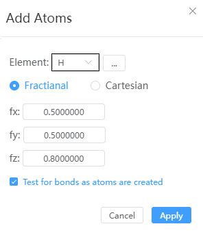

# Add atoms

- Elements: Supports selecting elements from the periodic table
- Fractional coordinates, Cartesian coordinates: When the structure does not have a lattice, only Cartesian coordinates can be set
- Calculate key length: When selected, the newly added atom automatically calculates whether it bonds with surrounding atoms