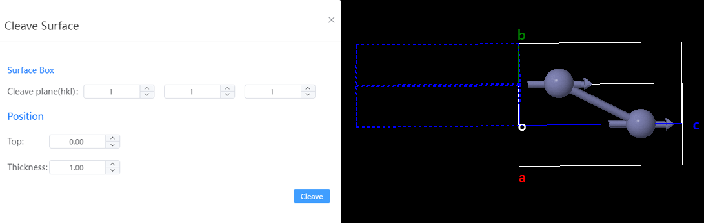

# Cleave Surface

- Define the surface lattice: Enter HKL information for the cut surface
- Location:
  - Offset: The distance of the slice from the origin O in angstroms
  - Thickness: The thickness of the two-dimensional SLAB, in angstroms
- Cleave surface: Switch to the build vacuum interface after clicking
  

  - Vacuum thickness: Add a vacuum layer to the slab
  - Location: The position of the slab centroid in the newly created lattice
  - Re-Cleave surface: Click to return to the cut surface interface
  - Accept: Closes the pop-up window
  - OK: Preview the structure after adding the vacuum layer  - 
