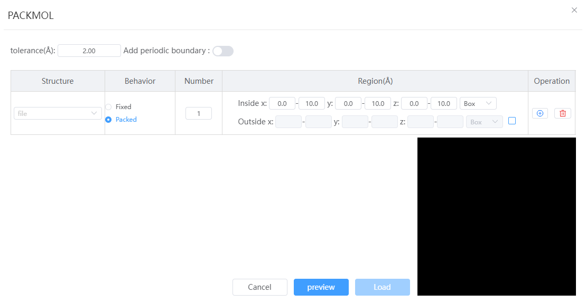
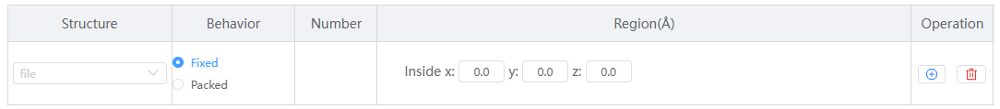

# Build an unordered structure

- Tolerated distance: The minimum distance between adjacent structural elements when filled
- Build periodic structure: when opened, lattice will be added to the disordered structure; Ltice size = disordered structure size + plus buffer

---

- Structure: Filling elements used to generate disordered structures, structures with/without lattices can be selected; Structures with lattices remove the lattice before filling
-Rules:
  - Fixed: You need to specify a fixed position
 
  - Filling: You need to specify the filling quantity and filling area; The rules for filling the area can be box or sphere, and 1-2 rules are supported
   

- Action: You can add or remove structures
  
---

- Preview: Click to generate a preview structure
- Loading: Create a new window in Q-Studio and import the structure in the preview interface