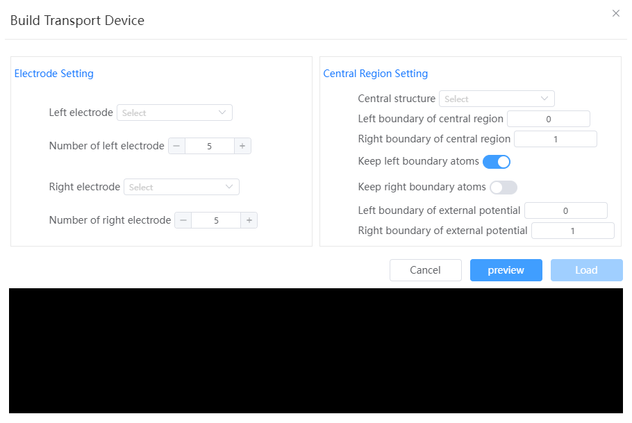

# Modeling of transport devices

- Metaelectrode setting
  - Left-element electrode structure: must be a lattice structure
  - Number of left element electrodes: 3-7, default is 5
  - Right-element electrode structure: must be a lattice structure
  - Number of right element electrodes: 3-7, default is 5
- Central area settings
  - Central zone structure: must be a lattice structure
  - Left boundary of the central zone: When constructing the transport device, the fractional coordinates of the central zone structure are less than the left boundary of the central zone are excised
  - Right boundary of the central zone: When constructing the transport device, the part of the structure in the central zone where the fractional coordinates are greater than the right boundary of the central zone are excised
  - Preserve the left boundary atoms of the middle region: Keep all atoms with fractional coordinates (left boundary, y, z) in the middle region structure.
  - Preserve the right boundary atoms of the middle region: Keep all atoms in the middle region structure with fractional coordinates (right boundary, y, z).
  - Impressed Potential Left Boundary: The left starting position of the bias
  - Impressed Potential Right Boundary: Right starting position of the bias

:::tip NOTE：
Note: The stitching direction is along the lattice A vector direction. The current direction follows the -a vector direction
:::