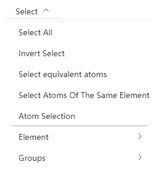

# Select Menu

- Select all atoms
- De-select atoms
- Select Equivalent Atoms: All equivalent atoms of the currently selected atom are selected according to the symmetry
- Select Atoms of the Same Element: Selects atoms of all elements involved in the currently selected atom
- [Advanced Atomic Selection](./qstudio_manual_select_advanced.md)

---

- Select by element: Selects all atoms of an element in the current structure
- Select by group: Select all atoms in a newly created group

