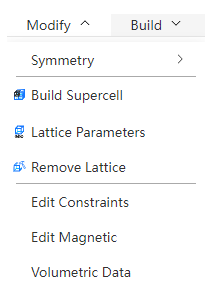

# Settings menu

<!--  -->
<!--  -->

- [symmetry](./qstudio_manual_settings_symmetry.md)
- [lattice constant](./qstudio_manual_settings_latticeconstant.md)
- [New construction and dismantling of lattices](./qstudio_manual_settings_newlattice.md)

---

- [Limit atomic movement](./qstudio_manual_settings_fixatom.md)
- [Set the magnetic moment](./qstudio_manual_settings_magmom.md)
- [Volume data](./qstudio_manual_settings_volumedata.md)