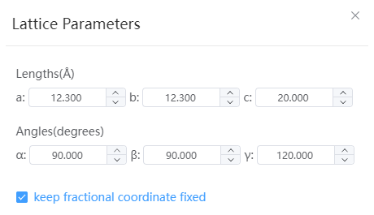

# Lattice Constant

The lattice of the model can be adjusted.

- Length, angle: lattice constants a, b, c, α, β, γ
- Keep atomic fractional coordinates: the default is selected, at this time adjust the lattice, the fractional coordinates of the atoms remain unchanged. When unchecked, the absolute coordinate XYZ of the atom remains unchanged, note that changing the α, β, and γ is not supported at this time.