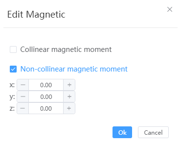

# Set the magnetic moment

Affects only the export of PWmat format structure files, sets initial magnetic moments for certain atoms within the structure, supports collinear and non-collinear magnetic moments, and visualizes them in the structure.
<table><tr>
    <td> 
        

            
        

    </td>
    <td> 
        

            
        

    </td>

</tr></table>

<!--  -->
