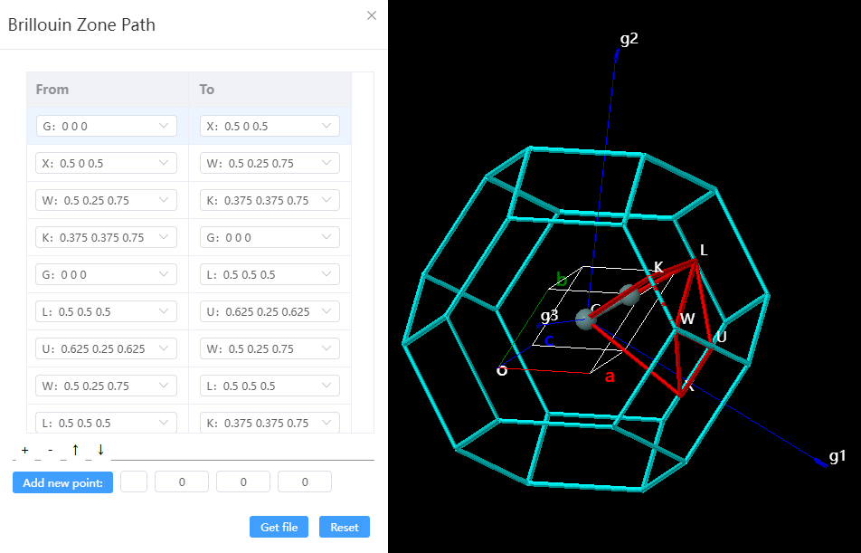

#Brillouin District Path

Based on the symmetry information, the highly symmetric K-points and their paths are visualized by the inverted lattice vector, the first Brillouin zone, and the Brillouin zone. After editing the high symmetry point path, you can export it to a high symmetry point path file in PWmat format.

- Generate: After clicking, according to the symmetry information, visualize the inverted lattice vector and the first brillouin zone, and return the automatically generated high-symmetry K points and their path information.

- Adjust the path: Click '+', '-' to add and delete the path, and click '↑', '↓' to move up and down the path. After entering the special K point symbol and location, click 'New Special K Point' to select the newly created special K point when editing the route.
  
- Get file: Enter the k-point spacing and click Accept to export the high-symmetry point path file gen.kpt to the local computer.
