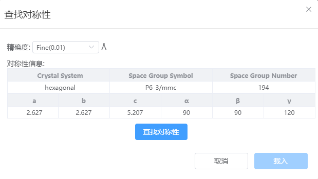

# Search for symmetry

- Accuracy: The tolerated distance used when finding symmetry, defaulting to Fine (0.01 angstroms)
- Symmetry information: The current crystal type, space group, and lattice constant will be displayed initially, and the information will be updated after clicking the Find Symmetry button
- Loading: When the symmetry information changes, you can replace the original structure with the structure after finding symmetry.