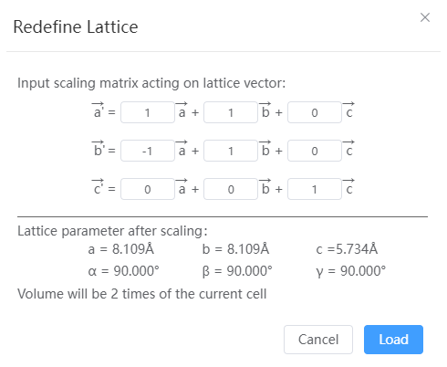

# Lattice transformation

The lattice vector is redefined on the basis of the existing base vector and the lattice vector is transformed under periodic conditions.

- Transformation matrix: TransMatrix. Suppose the original lattice vector matrix is LattMatrix, and the new lattice vector matrix after lattice transformation = TransMatrix * LattMatrix
- Lattice information after transformation: shows the lattice constant and volume change after transformation.
- Load: Replaces the transformed structure with the existing structure.