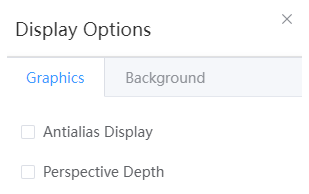

# View menu

<!--  -->

- [Display style](./qstudio_manual_view_display.md)
- Visibility: Hides or shows selected atoms; When atoms are not selected, you can only click Show, and all atoms will be displayed
- Rendering options: turn anti-aliasing, perspective depth on or off; Modify the background color
  
  

