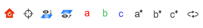
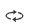

# Shortcut Perspective tool

- ：Reset the perspective
- ：Sets the center of rotation when in observation mode
- ：View onto
- ：View across
- ：The viewing angle is along the a-axis
- ：The viewing angle is along the b-axis
- ：The viewing angle is along the c-axis
- ：The viewing angle follows the A* (orthogonal to the BC) axis
- ：The viewing angle follows the b* (orthogonal to the AC axis) axis
- ：The viewing angle follows the C* (orthogonal to the AB) axis
- ：Automatically rotate the viewing angle
  
:::tip NOTE：
Use the keyboard `↑` `↓` `←` `→` to rotate the viewing angle, which is defined in the [Translation & Rotation](./qstudio_structtools.md) pop-up
:::
