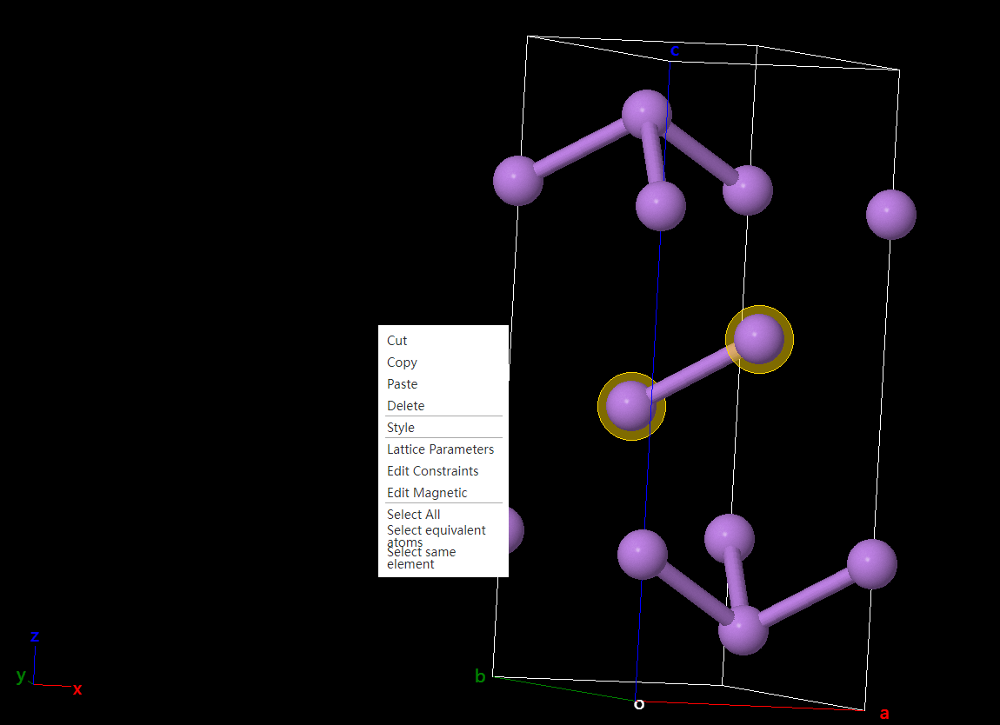

# Visualization area

## Select the mode

- Left mouse button on atoms: select individual atoms
- Left mouse button on an empty space: unchecked
- Hold down the left mouse button and drag the mouse: box to select multiple atoms
- Right-click: pop-up menu

  - [`Cut` `Copy` `Paste` `Delete`](./qstudio_manual_edit.md)
  - [`Display Style`](./qstudio_manual_view_display.md)
  - [`Lattice Constant`](./qstudio_manual_settings_latticeconstant.md)
  - [`Fix Atoms`](./qstudio_manual_settings_fixatom.md)
  - [`Set the magnetic moment`](./qstudio_manual_settings_magmom.md)
  - [`Select all atoms` `Select equivalent atoms` `Select atoms of the same element`](./qstudio_manual_select.md)
- Hold down the right mouse button to move the mouse: Rotate the viewing angle
- Keyboard `↑` `↓` `←` `→`: rotate the viewing angle by a fixed angle, the angle of rotation is defined in the [Translation and Rotation](./qstudio_structtools.md) pop-up
- Keyboard Delete: Deletes the selected atom

## View Mode

- Left-click on an atom: Select a single atom
- Left mouse button on an empty space: unchecked
- Hold down the left mouse button and drag the mouse: rotate the viewing angle
- Right-click: pop-up menu
- Hold down the right mouse button to move the mouse: rotate the viewing angle
- Keyboard `↑` `↓` `←` `→`: rotate the viewing angle by a fixed angle, the angle of rotation is defined in the [Translation and Rotation](./qstudio_structtools.md) pop-up
- Keyboard Delete: Deletes the selected atom

## Translate Mode

- Left-click on an atom: Select a single atom
- Left mouse button on an empty space: unchecked
- Hold down the left mouse button and drag the mouse: pan the viewing angle
- Right-click: pop-up menu
- Hold down the right mouse button to move the mouse: rotate the viewing angle
- Keyboard `↑` `↓` `←` `→`: rotate the viewing angle by a fixed angle, the angle of rotation is defined in the [Translation and Rotation](./qstudio_structtools.md) pop-up
- Keyboard Delete: Deletes the selected atom

## Drag atoms modes

- Hold down the left mouse button on the atom and drag the mouse: Drag the atom to move
- Move the mouse by holding down the left mouse button in an empty space: rotate the viewing angle
- Hold down the right mouse button to move the mouse: rotate the viewing angle
- Keyboard `↑` `↓` `←` `→`: rotate the viewing angle by a fixed angle, the angle of rotation is defined in the [Translation and Rotation](./qstudio_structtools.md) pop-up

## Drag molecules patterns

- Hold down the left mouse button on an atom belonging to the molecule and drag the mouse: Drag the molecule to move
- Move the mouse by holding down the left mouse button in an empty space: rotate the viewing angle
- Hold down the right mouse button to move the mouse: rotate the viewing angle
- Keyboard `↑` `↓` `←` `→`: rotate the viewing angle by a fixed angle, the angle of rotation is defined in the [Translation and Rotation](./qstudio_structtools.md) pop-up

## Measurement mode

- Left mouse button on the atom: start/end measurement
- Move the mouse by holding down the left mouse button in an empty space: rotate the viewing angle
- Hold down the right mouse button to move the mouse: rotate the viewing angle
- Keyboard `↑` `↓` `←` `→`: rotate the viewing angle by a fixed angle, the angle of rotation is defined in the [Translation and Rotation](./qstudio_structtools.md) pop-up