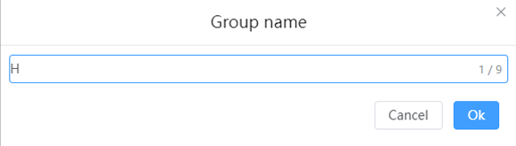
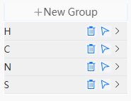
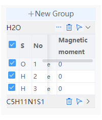

# Group information

- After selecting one or more atoms, you can click the New Group button to create a group for the selected atoms.
  

- After entering the group name and clicking Accept, a new group will appear in the group information area.

- Click  will delete the group
- Click  will quickly select all atoms in the group in the visual interface

- Click on a group in the group information  to expand the group. After expanding, you can view the element, sequence number, fixed atom, and magnetic moment information of the atoms in the group.
  

  - Check the first line  You can select all atoms in the group on the visual interface, or you can check the atoms in the group separately to make them selected in the visualization interface.
  - Click  can be set to restrict atomic movement or set magnetic moments, or from [Limit atomic movement pop-up](./菜单/qstudio_manual_settings_fixatom) or [Set magnetic moment pop-up](./菜单/qstudio_manual_settings_magmom).

:::tip NOTE：
Click on the Quick Structure tool  can perform a whole group of mobile functions
:::

