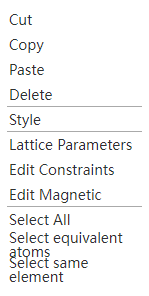

# Visualization area

## When Selection Mode is activated

- Left mouse button on atoms: select individual atoms
- Left mouse button on an empty space: unchecked
- Hold down the left mouse button and drag the mouse: box to select multiple atoms
- Right-click: pop-up menu

  - [Cut, Copy, Paste, Delete](./菜单/qstudio_manual_edit)
  - [Display Style](./菜单/qstudio_manual_view_display)
  - [Lattice Parameters](./菜单/qstudio_manual_settings_latticeconstant)
  - [Edit Constraints](./菜单/qstudio_manual_settings_fixatom)
  - [Edit Magnetic](./菜单/qstudio_manual_settings_magmom)
  - [Select All, Select equivalent atoms, Select same element](./菜单/qstudio_manual_select)
- Hold down the right mouse button to move the mouse: Rotate the viewing angle
- Keyboard `↑` `↓` `←` `→`: rotate the viewing angle by a fixed angle, the angle of rotation is defined in the [Translation and Rotation](./qstudio_structtools) pop-up
- Keyboard `Delete`: Deletes the selected atom

## When Rotation Mode is activated

- Left-click on an atom: Select a single atom
- Left mouse button on an empty space: unchecked
- Hold down the left mouse button and drag the mouse: rotate the viewing angle
- Right-click: pop-up menu
- Hold down the right mouse button to move the mouse: rotate the viewing angle
- Keyboard `↑` `↓` `←` `→`: rotate the viewing angle by a fixed angle, the angle of rotation is defined in the [Translation and Rotation](./qstudio_structtools) pop-up
- Keyboard `Delete`: Deletes the selected atom

## When Translation Mode is activated

- Left-click on an atom: Select a single atom
- Left mouse button on an empty space: unchecked
- Hold down the left mouse button and drag the mouse: pan the viewing angle
- Right-click: pop-up menu
- Hold down the right mouse button to move the mouse: rotate the viewing angle
- Keyboard `↑` `↓` `←` `→`: rotate the viewing angle by a fixed angle, the angle of rotation is defined in the [Translation and Rotation](./qstudio_structtools) pop-up
- Keyboard `Delete`: Deletes the selected atom

## When Drag Atom Mode is activated

- Hold down the left mouse button on the atom and drag the mouse: Drag the atom to move
- Move the mouse by holding down the left mouse button in an empty space: rotate the viewing angle
- Hold down the right mouse button to move the mouse: rotate the viewing angle
- Keyboard `↑` `↓` `←` `→`: rotate the viewing angle by a fixed angle, the angle of rotation is defined in the [Translation and Rotation](./qstudio_structtools) pop-up

## When Drag Molecule Mode is activated

- Hold down the left mouse button on an atom belonging to the molecule and drag the mouse: Drag the molecule to move
- Move the mouse by holding down the left mouse button in an empty space: rotate the viewing angle
- Hold down the right mouse button to move the mouse: rotate the viewing angle
- Keyboard `↑` `↓` `←` `→`: rotate the viewing angle by a fixed angle, the angle of rotation is defined in the [Translation and Rotation](./qstudio_structtools) pop-up

## When Measure opeartion is activated

- Left mouse button on the atom: start/end measurement
- Move the mouse by holding down the left mouse button in an empty space: rotate the viewing angle
- Hold down the right mouse button to move the mouse: rotate the viewing angle
- Keyboard `↑` `↓` `←` `→`: rotate the viewing angle by a fixed angle, the angle of rotation is defined in the [Translation and Rotation](./qstudio_structtools) pop-up