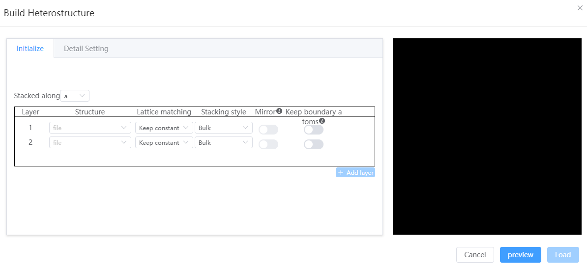
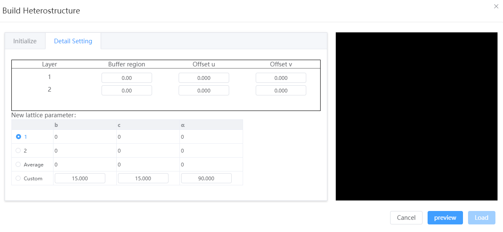

# Build Heterostructure

Splicing the selected 2 or 3 structures sequentially in a certain direction into a structure can generate 1D/2D, 2D/2D, 2D/3D and other types of heterojunctions; It can be selected when the lattice matching method is to keep the volume constant

- Initialize
  - Stacked along: can be `a`, `b`, `c`; Stacks structures sequentially by layer in the selected direction
  - Structure: Currently must be a lattice structure
  - Lattice matching: When stitching a structure, the structural lattice is adjusted. You can choose `keep volume constant` or `keep thickness constant`
  - Stacking style:
    - When the lattice matches `keep volume constant`, the stacking method must be `volume material` and the volume (density) of the structure must be unchanged
    - When the lattice is matched to `keep thickness constant`, the stacking method can be `bulk material`, `two-dimensional material`, `isolated system`. `Volume material` has a constant spacing of atomic layers in the structure; `Two-dimensional materials` remove the vacuum layer in the stacking direction, while the atomic layer spacing remains unchanged; The `isolated system` removes all vacuum layers while keeping the atomic spacing unchanged.
  - Mirror: The pre-stack structure is mirrored in the stacking direction, requiring the stacking direction to be orthogonal to the other two vector directions. For example, when the stacking direction is `a`, β=γ=90° is required, and the structure is mirrored in the `bc` plane
  - Keep boundary atoms: Preserve all atoms on the boundary of the structure along the stacking direction. For example, when the stacking direction is `a`, all atoms with fractional coordinates (0.0, y, z), (1.0, y, z) are retained.
  

- Detail setting
  - Buffer region: After stacking, add a buffer distance (vacuum)
  - Offset U, V: Before stacking, all atoms in the structure are translated in the plane of the vertical stacking direction for fractional coordinates
  - New lattice parameter: The lattice constant of a heterogeneous structure
    - When the stacking direction is `a`: the values of `b`, `c`, `α` need to be determined, `a` is calculated, `β`, `γ` will be averaged by each structure
    - When the stacking direction is `b`: you need to determine the values of `c`, `a`, `β`, `b` is calculated, `γ`, `α` will be averaged by each structure
    - When the stacking direction is `c`: you need to determine the values of `a`, `b`, `γ`, `c` is calculated, `α`, `β` will be averaged by each structure