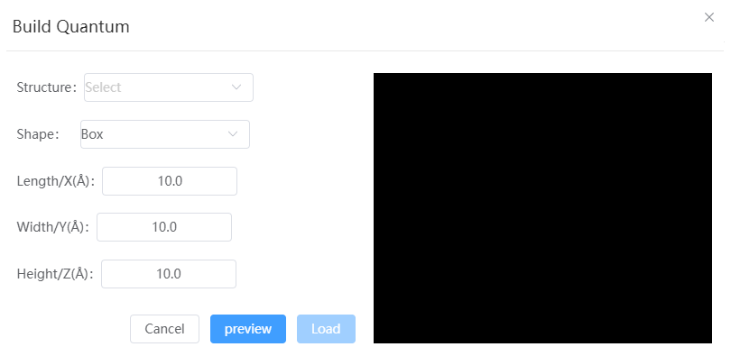
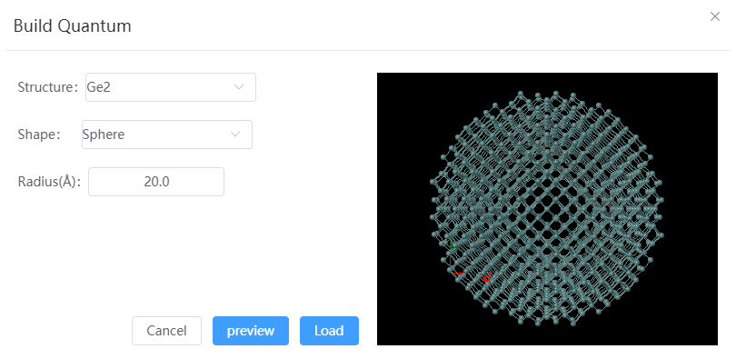

# Build Nanocluster

Generate cluster structures according to the selected structure file and shape; If the shape is Box, you need to set the length, width and height of the cluster box; If the shape is spherical, you need to set the radius of the cluster spherical shape

- Structure: Must be a structure with lattice
- Shape: Can be Box or Sphere
- Size:
  - Length, width and height: When the shape is Box
  - Radius: When the shape is Sphere

  
