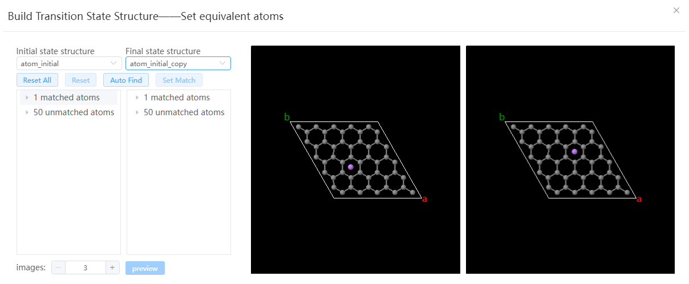

# Build Transition State Structure

## Set equivalent atoms

- Initial state structure: must be a lattice structure, the lattice constant, the total number of atoms of each element need to be consistent with the final state structure
- Final state structure: must be a lattice structure, the lattice constant, the total number of atoms of each element need to be consistent with the initial state structure
- Reset All: Resets all paired atoms
- Reset: Resets the currently selected paired atom
- Auto Find: Automatically pairs atoms based on sequence number and element
- Set Match: Pairs the currently selected atoms
- Images: The number of images of Transition state structure, and Linear interpolation is used by default
- Preview: After all atom pairings are completed, you can click to enter the preview window
  
## Preview

- Playback: Tap the previous frame, the next frame, the play button, or slide the slider to preview the transition structure
- Last Step: If you find that the match is wrong during the preview, you can go back to the previous step and re-match the equivalent atoms
- Load: Import the transition structure into a new window after confirmation

## Fine-tune the structure
  After loading, the position of atoms in each image can be fine-tuned frame by frame to adjust the initial migration path. The initial and final state structures are not allowed to be adjusted
