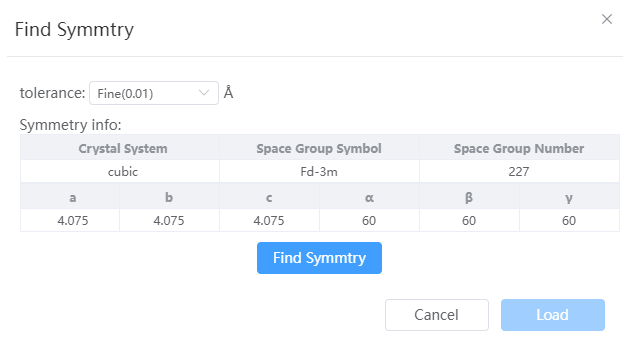

# Find Symmetry

- tolerance: The tolerated distance used when finding symmetry, defaulting to Fine (0.01 angstroms)
- Symmetry info: The current crystal system, space group, and lattice parameters will be displayed initially, and the information will be updated after clicking the Find Symmetry button
- Load: When the symmetry information changes, you can replace the original structure with the structure after finding symmetry.