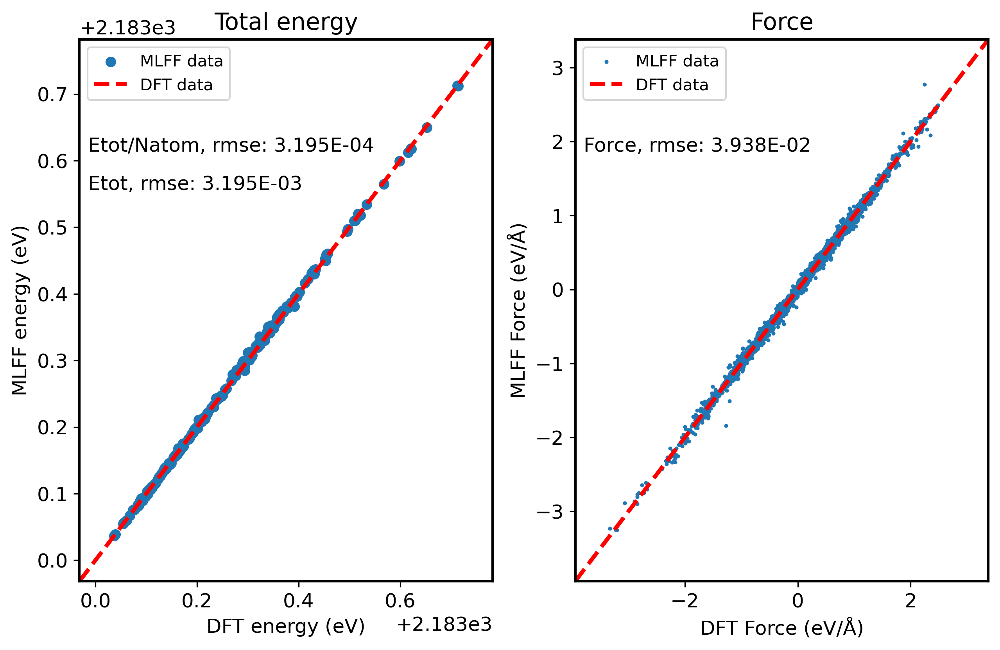

# Molecure Ethylene carbonate system

下文将以 C3H4O3 孤立体系为例，介绍如何使用 **PWMLFF Neural Network Model** 进行训练，以及如何使用训练好的模型进行预测。


整个过程分为以下几个步骤：

```mermaid
graph TD;
    A(PWMLFF)-->|产生数据集|AIMD;
    A(PWMLFF)-->|Neural Network Model|MLFF;
    A(PWMLFF)-->|预测|Prediction;
    AIMD-->atom.config;
    AIMD-->|原子运动轨迹|MOVEMENT;
    MLFF-->|提取特征|generate_data;
    MLFF-->|训练过程|load_and_train;
    MLFF-->|提取模型|extract_model_para;
    MLFF-->|验证|evaluation;
    evaluation-->plot_evaluation;
    Prediction-->|md_detail|run_md;
```

## 1. 产生数据集

以 PWmat AIMD 模拟得到的 C3H4O3 数据为例，数据文件为`MOVEMENT`，包含 200 个结构，每个结构包含 10 个原子。

**etot.input**输入文件示例：

```bash
8  1   
JOB = MD
MD_DETAIL = 2 200 1 400 400
XCFUNCTIONAL = PBE
Ecut = 60
ECUT2 = 240
MP_N123 = 1 1 1 0 0 0 3
ENERGY_DECOMP = T
IN.ATOM = atom.config
IN.PSP1 = C.SG15.PBE.UPF
IN.PSP2 = H.SG15.PBE.UPF
IN.PSP3 = O.SG15.PBE.UPF
```

- 必选项`ENERGY_DECOMP = T`：把总 DFT 能量分解为属于每个原子的能量（原子能量）。结果输出在`MOVEMENT`文件中。
- 其他参数含义参考[PWmat manual](http://www.pwmat.com/pwmat-resource/Manual.pdf)。

## 2. 训练过程

### 2.1 提取特征

新建目录`PWdata`，将`MOVEMENT`文件复制到该目录中。
:::tip NOTE
如果有多个`MOVEMENT`文件，需要在`PWdata`目录下分别新建目录（名称任意），并将 `MOVEMENT` 文件分别放入其中。每个目录只能放一个`MOVEMENT`。

:::

### 2.2 训练输入文件

在`PWdata`同级目录下，新建`main.py`文件，执行该文件提取特征并进行训练。

**输入文件示例：**

```python
from PWMLFF.nn_network import nn_network

if __name__ == '__main__':

    # atom type to be used. MUST BE SPECIFIED
    atom_type = [8,6,1]

    # feature to be used. MUST BE SPECIFIED
    feature_type = [7]

    # create an instance. MUST BE DONE.
    kfnn_trainer = nn_network(
                                atom_type = atom_type,
                                feature_type = feature_type,
                                n_epoch = 20,              # number of epochs
                                Rmax = 6.0,
                                Rmin = 0.5,
                                # is_trainEi = True,           # train atomic energy
                                kalman_type = "GKF",      # using global Kalman filter
                                device = "cuda",              # run training on gpu
                                recover = False,             # recover previous training
                                session_dir = "record"       # directory that contains
                                )

    # generate data from MOVEMENT files
    # ONLY NEED TO BE DONE ONCE
    kfnn_trainer.generate_data()

    kfnn_trainer.load_and_train()
```

- `atom_type`：原子类型，8, 6 和 1 分别为 O, C 和 H 的原子序数
- `feature_type`：特征类型，5 对应 Moment Tensor Potential，详见[特征类型](./Appendix-1.md)
- `n_epoch`：训练迭代次数
- `Rmax`：特征的最大截断半径
- `Rmin`：特征的最小截断半径
- `is_trainEi`：是否训练原子能量，默认为 False
- `kalman_type`：优化器类型，默认为`GKF`，可选`LKF`和`selected`
- `device`：训练设备，默认为`cuda`，可选`cpu`
- `recover`：是否继续之前的训练，默认为`False`
- `session_dir`：训练记录保存目录，默认为`record`

:::tip
以下二个函数可根据实际使用情况选择执行：

- kfnn_trainer.generate_data() - 用于产生特征，仅需运行一次。例如需要重新启动训练时,只需注释掉该行再次执行程序即可。
- kfnn_trainer.load_and_train() - 用于加载特征,对特征进行处理后开始训练。

:::

### 2.3 运行

以下适用于 Mcloud,提交任务时确保已经加载必要的环境和模块。

```bash
#!/bin/sh
#SBATCH --partition=3080ti
#SBATCH --job-name=mlff
#SBATCH --nodes=1
#SBATCH --ntasks-per-node=1
#SBATCH --gres=gpu:1
#SBATCH --gpus-per-task=1

python main.py > log
```

交互式运行：

```bash
$ srun -p 3080ti --gres=gpu:1 --pty /bin/bash
$ python main.py
```

---

程序运行后，会在`PWdata`目录下生成`input`,`output`,`train_data`,`fread_dfeat`及`record`目录，同时`PWdata`目录下会产生新的文件：

- **input**

  - location
  - info_dir
  - gen\_\*\_feature.in
  - egroup.in

- **output**

  - grid\*
  - max_natom
  - out_write_egroup

- **fread_dfeat**

  - feat.info
  - vdw_fitB.ntype
  - **NN_output**
    - dfeatname\*
    - egroup\*
    - feat\*
    - natom\*
    - _NNEi_
    - _NNFi_

- **train_data**

  - **final_train**
    - \*.npy
  - **final_test**
    - \*.npy

- **PWdata**

  - location
  - dfeat\*
  - info\*
  - trainData\*
  - inquirepos\*
  - MOVEMENTall
  - Egroup_weight

- **record**
  - iter_loss.dat： 每个 batch 的训练误差
  - iter_loss_valid.dat： 每个 batch 的验证误差
  - epoch_loss.dat: 每个 epoch 的训练误差
  - epoch_loss_valid.dat： 每个 epoch 的验证误差
  - scaler.pkl: extracting scaler values of the model
  - **model**
    - \*.pt: extracting parameters of the model

:::info epoch_loss.dat&epoch_loss_valid.dat


- `loss` 对应训练总误差
- `RMSE_Etot` 对应训练能量误差
- `RMSE_F` 对应训练力误差

<font color='red'>如果训练集的误差比验证集的误差明显偏小,表明训练过拟合,可适当增加训练集的大小或调整 batch_size 的数量。</font>

:::

## 3. 验证/测试

训练完成后，可以对模型进行验证/测试，以确定模型的拟合效果。

在`PWdata`同级目录下，新建`MD`目录，将另一个的`MOVEMENT`文件复制到该目录中。

:::caution
该 MOVEMENT 文件同样需要在 AIMD 模拟过程中设置`ENERGY_DECOMP = T`，以便提取原子能量。
:::

**验证输入文件示例：**

```python
from PWMLFF.nn_network import nn_network

if __name__ == '__main__':

    # atom type to be used. MUST BE SPECIFIED
    atom_type = [8,6,1]

    # feature to be used. MUST BE SPECIFIED
    feature_type = [7]

    # create an instance. MUST BE DONE.
    kfnn_trainer = nn_network(
                                atom_type = atom_type,
                                feature_type = feature_type,
                                n_epoch = 20,              # number of epochs
                                Rmax = 6.0,
                                Rmin = 0.5,
                                # is_trainEi = True,           # train atomic energy
                                kalman_type = "GKF",      # using global Kalman filter
                                device = "cuda",              # run training on gpu
                                recover = False,             # recover previous training
                                session_dir = "record"       # directory that contains
                                )

    # extract network parameters for inference module. MUST-HAVE, ONLY ONCE
    kfnn_trainer.extract_model_para()

    # run evaluation
    kfnn_trainer.evaluate()

    # plot the evaluation result
    kfnn_trainer.plot_evaluation(plot_elem = False, save_data = False)
```

:::tip

- kfnn_trainer.extract_model_para() - 该函数用于提取训练好的模型参数，必须在`evaluate()`函数之前执行。
- kfnn_trainer.evaluate() - 该函数调用`/MD/MOVEMENT`用于验证训练好的模型
- kfnn_trainer.plot_evaluation() - 用于绘制验证结果图，结果保存在`plot_data`目录下
  - 
  - `plot_elem`: 是否绘制元素能量，默认为`False`。若为`True`，则会绘制每种元素的原子能量
  - `save_data`: 是否保存验证结果，默认为`False`。

:::

## 4. 使用模型进行预测

通过对模型的验证，可以确定模型的拟合效果。在模型拟合效果满意的情况下，可以使用模型进行分子动力学预测。

首先需要准备一个初始构型文件，例如`atom.config`文件。该文件可以不同于训练时的构型文件，但需要保证原子类型与训练时一致。

**输入文件示例：**

```python
from PWMLFF.nn_network import nn_network

if __name__ == '__main__':

    # atom type to be used. MUST BE SPECIFIED
    atom_type = [8,6,1]

    # feature to be used. MUST BE SPECIFIED
    feature_type = [7]

    # create an instance. MUST BE DONE.
    kfnn_trainer = nn_network(
                                atom_type = atom_type,
                                feature_type = feature_type,
                                n_epoch = 20,              # number of epochs
                                Rmax = 6.0,
                                Rmin = 0.5,
                                # is_trainEi = True,           # train atomic energy
                                kalman_type = "GKF",      # using global Kalman filter
                                device = "cuda",              # run training on gpu
                                recover = False,             # recover previous training
                                session_dir = "record"       # directory that contains
                                )

    # md_detail array
    md_detail = [1,1000,1,500,500]

    # run MD
    kfnn_trainer.run_md(md_details = md_detail, follow = False)
```

:::tip

- md_detail - 用户必须自行设置的 MD 参数: 1) MD 类型，2) MD 步数，3) MD 步长，4) MD 初始温度，5) MD 终止温度。详细设置请参考[PWmat manual](http://www.pwmat.com/pwmat-resource/Manual.pdf)
- kfnn_trainer.run_md() - 运行 AIMD 模拟的函数，该函数运行结束后会在当前目录下生成一个新的`MOVEMENT`文件
  - `follow`: 删除旧的 MOVEMENT 文件，默认为`False`。若为`True`，则会在原来的 MOVEMENT 文件上继续追加新的 MD 结果。

:::

---

## 5. All-in-one

以下是一个完整的训练、验证、预测的示例（需要准备好`atom.config`及`MD/MOVEMENT`）：

```python
"""
    example of Neural Network workflow
"""
from PWMLFF.nn_network import nn_network

if __name__ == '__main__':

    # atom type to be used. MUST BE SPECIFIED
    atom_type = [8,6,1]

    # feature to be used. MUST BE SPECIFIED
    feature_type = [7]

    # create an instance. MUST BE DONE.
    kfnn_trainer = nn_network(
                                atom_type = atom_type,
                                feature_type = feature_type,
                                n_epoch = 20,              # number of epochs
                                Rmax = 6.0,
                                Rmin = 0.5,
                                # is_trainEi = True,           # train atomic energy
                                kalman_type = "GKF",      # using global Kalman filter
                                device = "cuda",              # run training on gpu
                                recover = False,             # recover previous training
                                session_dir = "record"       # directory that contains
                                )

    # generate data from MOVEMENT files
    # ONLY NEED TO BE DONE ONCE
    kfnn_trainer.generate_data()

    kfnn_trainer.load_and_train()

    # extract network parameters for inference module. MUST-HAVE, ONLY ONCE
    kfnn_trainer.extract_model_para()

    # run evaluation
    kfnn_trainer.evaluate()

    # plot the evaluation result
    kfnn_trainer.plot_evaluation(plot_elem = False, save_data = False)

    # md_detail array
    md_detail = [1,1000,1,500,500]

    # run MD
    kfnn_trainer.run_md(md_details = md_detail, follow = False)
```
