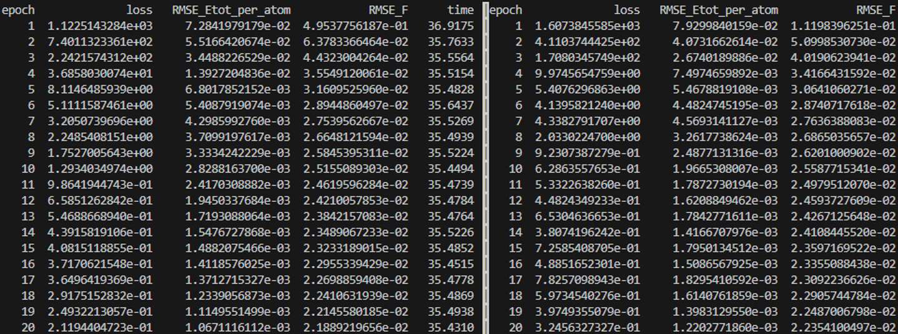
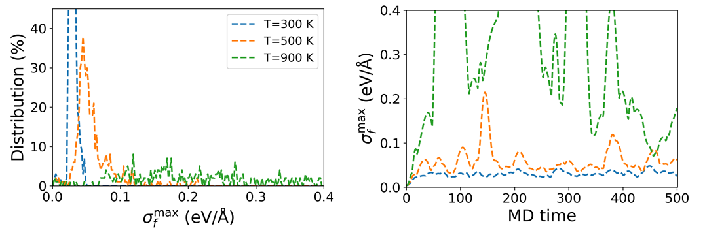
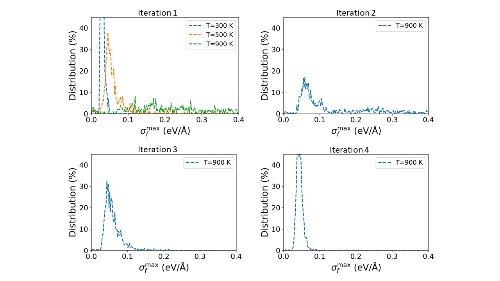

# Bulk Si system (Active Leanring)

下文将以 Bulk Si 系统为例，介绍如何使用 **PWMLFF Deep Potential Model** 进行训练，同时结合**主动学习**加强模型泛化性，并进行 lammps 模拟。

力场训练结束时得到的力场文件为`*.ff`，该文件包含了训练得到的所有参数，可用于 lammps 模拟。模拟时发现模型在同一个体系，不同温度下的表现是不同的，因此需要针对不同温度下的体系进行训练。在本例中，我们首先测试模型在 3 个不同温度下的表现，分别为 300K、500K、900K。根据下述教程可以发现，模型在 900K 下的表现非常差，因此我们需要针对 900K 下的体系进行训练，以提高模型的泛化性，准确描述该体系在300K - 900K 区间的动力学行为。

主动学习流程如下图所示：
<center></center>


主动学习工作目录整体结构示意

```
Si_system/adaptive_trainer
└── dir
    ├── 00.initdata                # 初始数据集(AIMD)
    │   ├── perturb.py             # 微扰结构，执行文件
    │   └── Structure ( Si64 )     # 初始结构 'atom.config' 存放目录，以Si64为例
    │       ├── atom.config        # 初始结构，用于产生数据集
    │       ├── structures         # 执行perturb.py后产生的结构所存放的目录
    │       └── AIMD               # AIMD（初始数据集）结果存放目录
    │           ├──md-0            # 从structures中提取的结构文件存放目录
    │           └──md-..
    │
    ├── 01.Iteration1              # 初次迭代目录
    │   ├── 00.train               # 初始训练集(generate_data),必须为00.train
    │   │   ├── 000                # 4个力场训练(load_and_train & extract_force_field)
    │   │   ├── 001                # 可以训练多个力场
    │   │   ├── 002                # 但是必须以 00x 的格式命名
    │   │   └── 003
    │   ├── 01.explore             # 探索目录
    │   │   ├── explore.py         # 探索执行文件
    │   │   ├── explore
    │   │   ├── model              # 存放力场文件的目录
    │   │   ├── result             # 存放lammps计算后筛选出的结构文件的目录
    │   │   └── subsys             # 从Strucutre中获取结构文件，并进行lammps计算
    │   └── etot.input             # 用于完成PWmat自洽计算
    │
    ├── 02.Iteration2              # 第二次迭代目录...再原有数据集基础上添加新的训练集再次进行训练及探索
    │   ├── 00.train
    │   └── 01.explore
    │
    │
    ├── 03.Iteration3              # 第三次迭代目录...
    │   ├── 00.train
    │   └── 01.explore
    │
    └── 04.Iteration4              # 第四次迭代目录...
        ├── 00.train
        └── 01.explore
```

## 1. 初始数据准备

为了获取相同体系下不同的初始结构，用于进行 AIMD 计算，获取原子运动轨迹。在本例中，我们提供了一个方式，将使用`perturb.py`对原子进行晶格及原子位置微扰，生成 50 个初始结构，用于进行 AIMD 计算。`perturb.py`的使用方法如下：

主动学习模块引入了新的接口，需要提前在 PWMLFF package 中安装：

在线安装:

```python
$ conda activate PWMLFF
$ cd path_to/PWMLFF/src
$ git clone https://github.com/lhycms/MaterSDK.git
$ cd MaterSDK
$ pip install .
```

源码:

```python
https://github.com/lhycms/MaterSDK
```

---

新建`Si64`目录，将并在目录下存放初始结构`atom.config`。准备完成后直接执行`python perturb.py`即可，执行后会在`Si64`目录下生成`structures`目录，其中存放了扰动后的结构文件，同时在`Si64`目录下生成`AIMD`目录，其中同样存放了扰动后的结构文件，之后用于 AIMD 计算获取原子运动轨迹。


以下是`perturb.py`的示例：

```python
from MaterSDK.matersdk.adalearn.generator.perturbation import BatchPerturbStructure
import os
if __name__ == "__main__":

    """
    1. only need to run once!!!
    2. perturb the structure
    3. seed for adaptive sampling
    """

    Perturbed = ['Si64']
    pert_num = 50
    cell_pert_fraction = 0.03
    atom_pert_distance = 0.01

    BatchPerturbStructure.batch_perturb(
        Perturbed=Perturbed,
        pert_num=pert_num,
        cell_pert_fraction=cell_pert_fraction,
        atom_pert_distance=atom_pert_distance,
    )


    aimd_directory = os.path.join(os.path.abspath(Perturbed[0]), 'AIMD')
    if not os.path.exists(aimd_directory):
        os.makedirs(aimd_directory)

    # Create 'md-0', 'md-1', ..., 'md49' directories under 'AIMD' directory
    for i in range(pert_num):
        md_directory = os.path.join(aimd_directory, f'md-{i}')
        if not os.path.exists(md_directory):
            os.makedirs(md_directory)

        # Link the corresponding config file from 'structures' directory to 'md-{i}' directory
        config_file = os.path.join(os.path.abspath(Perturbed[0]), 'structures', f'{i}.config')
        link_file = os.path.join(md_directory, 'atom.config')
        if os.path.islink(link_file):
            os.remove(link_file)
        os.symlink(config_file, link_file)
```

- `Perturbed` 需要指定所存放的`atom.config`所在目录的名称
- `pert_num`为每个体系的扰动结构数目，即需要根据提供的`atom.config`对结构进行包括晶格和原子位置的扰动，以增强结构的采样变化
- `cell_pert_fraction`为扰动的晶胞尺寸
- `atom_pert_distance`为扰动的原子位置

进入`AIMD`目录，准备一个`etot.input`文件，内容示例如下，用户可以根据具体的体系完成设置，参数意义参考[PWmat manual](http://www.pwmat.com/pwmat-resource/Manual.pdf)：

```bash
4 1
job = MD
MD_DETAIL = 2 10 1 1000 1000
XCFUNCTIONAL =  PBE
in.atom = atom.config
mp_n123 = 2 2 2 0 0 0 3
ecut = 60
ecut2 = 240
ENERGY_DECOMP = T
OUT.STRESS = T
in.psp1 = Si.SG15.PBE.UPF
```

:::info

1. 这里仅使用 10fs 的时间步长，实际使用中需要根据体系进行设置。50 个结构拼接起来的`MOVEMENT`轨迹有 500 帧，即 500fs.

2. 可以使用以下命令将 PWmat 输入文件`etot.input`及 slurm 作业脚本`slurm.sh`拷贝到`md-0, md-1, ..., md-49`目录下：

   ```bash
   for i in {0..49}
   do
   cd md-$i
   ln -s ../etot.input
   ln -s ../slurm.sh 
   ln -s ../Si.SG15.PBE.UPF
   sbatch slurm.sh
   cd ..
   done
   ```

3. 计算完成后，可以使用以下命令将所有结构的`MOVEMENT`拼接起来：
    ```bash
    for i in {0..49}
    do
    cat md-$i/MOVEMENT >> MOVEMENT
    done
   ```

:::

该`MOVEMENT`文件将用于后续的训练。

## 2. 初始训练集

产生训练集及训练的参数设置参考 [Cu example](./Cu.md)。

以下提供一个可供参考的建议：

可以先仅使用`dp_trainer.generate_data()`产生数据集。文件目录结构如正文首页所示。然后目录下新建`000,001,002,003`目录，将`generate_data`产生的数据集分别放入`000,001,002,003`目录中(以 4 个力场为例)，然后再分别进行训练。


分别进入目录内，可以使用`ln -s`命令将`PWdata`,`train`,`valid`目录链接到目录内。

```bash
ln -s ../PWdata
ln -s ../train
ln -s ../valid
```

以下是训练时的参数设置：

```python
from PWMLFF.dp_network import dp_network

if __name__ == "__main__":

    atom_type = [14]

    """
        command line option:
        python main.py --gpu 0 -b 20 --opt LKF --epochs 1 -s record
    """

    dp_trainer = dp_network(
                            atom_type = atom_type,
                            optimizer = "LKF",
                            gpu_id = 0,
                            session_dir = "record",
                            n_epoch = 20,
                            batch_size = 10,
                            Rmax = 6.0,
                            Rmin = 0.5,
                            M2 = 16,
                            dataset_size = 1000,
                            block_size= 10240,
                            seed = 111,
                            is_virial = False,   # default is false
                            is_egroup = False,   # default is false
                            is_resume = False,
                            is_evaluate= False,
                            # model_name = 'checkpoint.pth.tar',
                            pre_fac_force = 1.,
                            pre_fac_etot = .5,
                            # pre_fac_virial = 1.,
                            # pre_fac_egroup = .1,
                            embedding_net_size = [25, 25, 25],
                            fitting_net_size = [50, 50, 50, 1],
                           )

    dp_trainer.load_and_train()

    dp_trainer.extract_force_field()
```

:::info

1. 此时不需要再次使用`dp_trainer.generate_data()`产生数据集。

2. 需要注意的是，对于 4 个目录下的训练，需要为不同的训练设置不同的种子数`seed`。

3. 多个元素时，`atom_type`统一设置为`MOVEMENT`中的原子排序。

:::

## 3. 主动学习探索过程

初始力场生成后，新建目录`01.explore`，并准备`etot.input`输入文件用于后续的自洽计算，以生成新的数据集用于二次训练。

:::caution

1. 训练完成后，请检查`epoch_train.dat`及`epoch_valid.dat`文件，确保训练 loss 达到一定的收敛程度。



- `loss` 对应训练总误差
- `RMSE_Etot_per_atom` 对应训练能量误差，建议达到 ~$10^{-3} eV/atom$ 数量级
- `RMSE_F` 对应训练力误差， 建议达到 ~$10^{-2} eV/\text{\AA}$ 数量级

- <font color='red'>如果训练集的误差比验证集的误差明显偏小,表明训练过拟合,可适当增加训练集的大小或调整 batch_size 的数量。</font>

2. 训练完成后生成的`*.ff`力场文件需要用于 lammps 模拟，请[下载经过修改的版本](https://github.com/LonxunQuantum/Lammps_for_PWMLFF)重新编译 lammps。

:::

其中`etot.input`文件内容示例如下，用户可以根据具体的体系完成设置，参数意义参考[PWmat manual](http://www.pwmat.com/pwmat-resource/Manual.pdf)：

```bash
4 1
job = scf
in.atom = atom.config
in.psp1 = /share/psp/NCPP-SG15-PBE/Si.SG15.PBE.UPF
accuracy = high
ecut = 60.0
wg_error = 0.0
e_error = 0.0001
rho_error = 0.0
out.wg = F
out.rho = F
out.vr = F
out.force = T
out.stress = T
out.mlmd = T
energy_decomp = T
```

:::info

1. `out.mlmd = T`,`out.force = T`及`energy_decomp = T`为必选项。
2. 请使用最新版本的 PWmat
3. 该模板并未指定`mp_n123`，将由后续的`adaptive_trainer`根据`kspacing`自动设置。

:::

此时需要读取之前微扰产生的结构文件用于 lammps 计算。具体用途见下文。

```python
from mods.adaptive_trainer import adaptive_trainer

if __name__ == "__main__":

    """
        1. as long as the seed doesn't change, only need to update .ff at every iteration
        2. OUT.MLMD should be processed to shift the atomic energies
    """
    temp_range = [300,500,900]
    pressure_range= [1.0]

    adpt_trainer = adaptive_trainer(
                                    temp = temp_range,
                                    pressure=pressure_range,
                                    etot_path = "~/2_MLFF/2-DP/9-Si/5-adpa/01.explore/etot.input",
                                    struct_dir = "~/2_MLFF/2-DP/9-Si/5-adpa/00.initdata/Si64",
                                    model_num = 4,
                                    process_num = 64,           # for lmp traj gen
                                    lmp_nprocs = 4,            # lammps cpu core
                                    kspacing = 0.16,
                                    ensemble= "nvt",
                                    md_dt = 0.001,
                                    traj_step = 500,
                                    num_select_per_group = 200,
                                    atom_type = [14],
                                    success_bar = 0.15,
                                    candidate_bar = 0.35,
                                   )
    adpt_trainer.explore()
```

- `temp_range`为 lammps 计算的温度范围(lammps 输入文件参数设置)
- `pressure_range`为 lammps 计算的压力范围
- `etot_path`为所使用的自洽计算输入文件所在路径
- `struct_dir`为所使用的初始结构文件目录所在路径，对应前面的`Perturbed`目录
- `model_num`为所使用的力场数目
- `process_num`为所使用的 lammps 计算总核数，需要保证`process_num`为`lmp_nprocs`的整数倍
- `lmp_nprocs`为每个 lammps 计算进程所使用的 cpu 核数
- `kspacing`为所使用的 k 点取值间隔，单位为$\frac{1}{\text{\AA}}$
- `ensemble`为所使用的分子动力学系综，如`nvt`,`npt`
- `md_dt`为 lammps 的 md 步长，目前仅支持`unit metal`,`0.001`对应`1fs`
- `traj_step`为 lammps 的 md 步数，初次探索时可以设置为较小的值，如`500`，后续探索时根据 error 结果逐步增大，如`1000`,`2000`,`4000`等
- `num_select_per_group`为最后从 lammps 计算中随机选取的结构数目
- `atom_type`为所使用的原子类型，与前面训练时保持一致的排序
- `success_bar`为所使用的探索成功率置信区间$\sigma_l$，初次探索时可以设置为较大的值，如`0.15`，后续探索时可以缩小范围，如`0.12`,`0.1`,`0.08`等
- `candidate_bar`为所使用的探索候选率置信区间$\sigma_h$，初次探索时可以设置为较大的值，如`0.35`，后续探索时可以缩小范围，如`0.25`,`0.2`,`0.18`等
- `adpt_trainer.explore()`为核心探索函数，执行该函数后会自动进行探索

:::info

1. $\sigma_f < \sigma_l$ 表明区间内对应结构的原子受力都被准确地预测，不需要进行 DFT 计算。
2. $\sigma_f \ge \sigma_h$ 表明势函数预测相应结构的原子受力误差太大，不适合作为升级势函数的候选结构。
3. $\sigma_l \le \sigma_f < \sigma_h$ 表明势函数预测相应结构的原子受力有一定误差，又不会太大，最适合作为升级当前势函数的候选结构，将会从中随机抽样`num_select_per_group`个结构进行 DFT 计算打上标签，获取新的数据集。
4. 执行该`.py`文件时，确保环境变量中存在`PWmat`主程序。

:::

### 3.1 运行

以下适用于 Mcloud,提交任务时确保已经加载必要的环境和模块。如`module load pwmat`等。


```bash
#!/bin/sh
#SBATCH --partition=cpu
#SBATCH --job-name=lmp
#SBATCH --nodes=1
#SBATCH --ntasks-per-node=64

echo "Starting job $SLURM_JOB_ID at " `date`
echo "SLURM_SUBMIT_DIR is $SLURM_SUBMIT_DIR"
echo "Running on nodes: $SLURM_NODELIST"

python explore.py

echo "Job $SLURM_JOB_ID done at " `date`
```

* --ntasks-per-node=64 与`process_num`的值一致。

程序运行结束后，可以检查当前目录下生成的`explore.ratio`文件，其内容如下：

```bash
num of all img: 73815
ratio of success: 0.8031294452347084
ratio of candidate: 0.19326695116168802
ratio of failure: 0.0036036036036036037
```
* `num of all img`为探索过程中所有的结构数目(trajectory)
* `ratio of success`为探索成功率
* `ratio of candidate`为探索候选率，即筛选出可用于自洽计算的结构数目的比率
* `ratio of failure`为探索失败率


在`./explore/result`目录下生成`num_select_per_group`个结构文件及`etot.input`文件。


同时会生成`nvt_explr_plot`目录，其中`dev_fmax.png`文件，为不同温度/压力下探索成功率和探索候选率的置信区间分布。

如下图所示 

根据探索时设置的`success_bar`和`candidate_bar`，可以确定探索成功率和探索候选率的置信区间。如图中 300K 和 500K 在分布在 0.1 以内的峰值(Distribution)越高，说明探索成功率和探索候选率越高，即对应力场的在 300K 和 500K 时训练效果表现越好。

而根据$\sigma_f^{max}$随 MD 步数变化的曲线，可以确定探索的收敛性。如图中 300K 的$\sigma_f^{max}$随 MD 步数变化的曲线趋向于平缓，说明探索已经收敛，即对应力场的在 300K 时训练效果表现越好。

## 4. 迭代探索

迭代探索的目的是为了进一步提高力场的泛用性，即在更多的温度/压力下，探索成功率和探索候选率都能达到较高的置信区间。**后续教程中以 bulk Si 在 900K 时的径向分布函数来验证力场的性能。**

具体做法是将初次探索时得到的存储在`/explore/result`目录下结构文件进行静态计算，并将所有结构静态计算得到的`OUT.MLMD`文件拼接成一个新的`MOVEMENT`文件。然后将其加入到数据集中（目录下包含原有的`MOVEMENT`），重新训练力场，再进行探索。

计算完成后，请检查所有计算是否收敛，若有未收敛的计算，请重新计算。以下是一个用于检查的示例脚本：

```bash
#!/bin/bash

directories=($(find . -type f -name "etot.input" -exec dirname {} \;))

##############################
sum_n=0
sum_t=0
no_converge_directories=()
scf_stop_directories=()
for i in "${directories[@]}"; do
  niter_count=$(grep -c "niter" "$i/REPORT")
  time_count=$(grep -c "time" "$i/REPORT")
  sum_n=$((sum_n + niter_count))
  sum_t=$((sum_t + time_count))

  if [ "$niter_count" -eq 1 ]; then
    no_converge_directories+=("$i")
  fi

  if [ "$time_count" -eq 0 ]; then
    scf_stop_directories+=("$i")
  fi
done

echo "Number of scf failures: $sum_n"
echo "Number of scf success: $sum_t"
echo "No converge in: ${no_converge_directories[*]}"
echo "scf stop in: ${scf_stop_directories[*]}"
```

```bash
$ bash test.sh 
Number of scf failures: 1
Number of scf success: 99
No converge in: ./12
scf stop in: 
```

计算完成后，可使用以下命令将`OUT.MLMD`拼接为一个新的`MOVEMENT`：

```bash
for i in {0..199}
do
cat $i/OUT.MLMD >> MOVEMENT
done
```

迭代探索完成后，同样根据`dev_fmax.png`图中$\sigma_f^{max}$的分布曲线，可以确定力场的表现。

结果如下图所示 

经过多次的迭代探索，探索成功率和探索候选率的置信区间都达到了较高的值。接着可以使用该力场进行 bulk Si (216 atoms)在 900K 时的径向分布函数的计算,结果如下图所示


可以看到，使用 bulk Si (64 atoms) 小结构进行训练得到的力场，却能正确描述 builk Si (216 atoms)大结构的动力学行为，即使用该力场进行 lammps 计算得到的径向分布函数与 DFT 计算得到的结果吻合较好。
