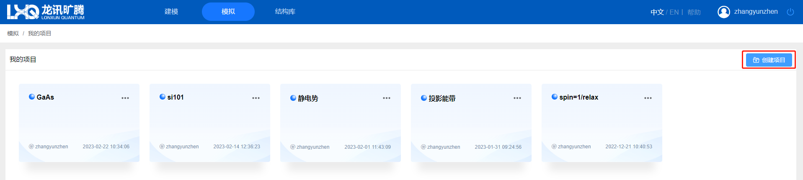
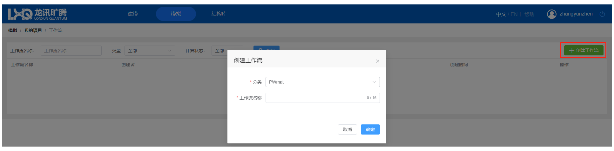
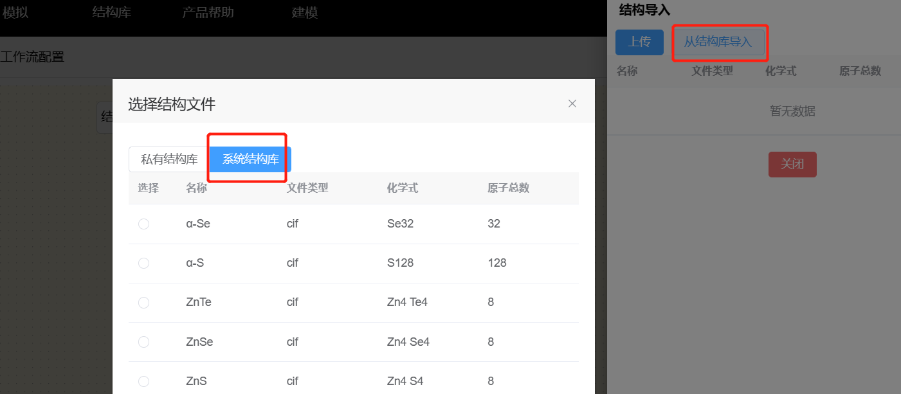
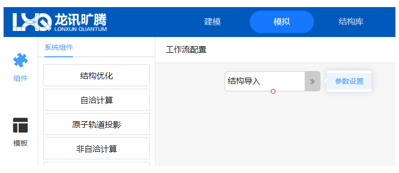
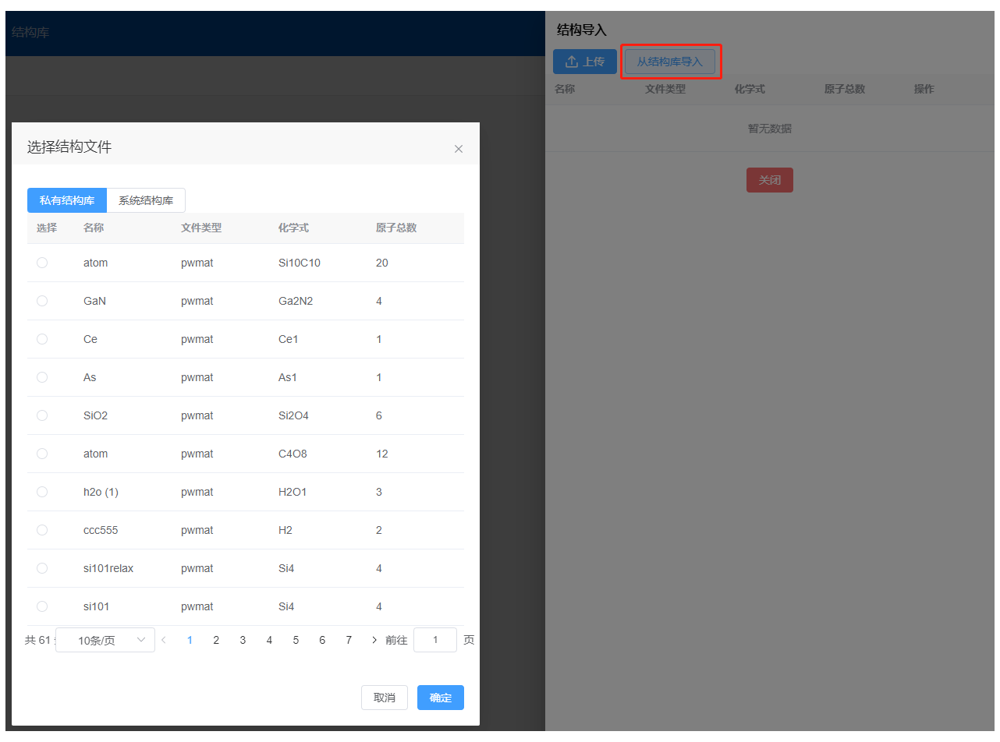

# 创建项目、工作流、导入晶体结构

Q-Flow 采用项目管理模式。在模拟主界面，点击`创建项目` → `输入项目名称` → `确定` → `点击新建的项目`，进入项目管理界面。
创建的项目会显示创建者、创建日期。项目可以修改名称、删除。
项目中一般包含不同体系的计算任务和结果，便于用户区分。

<!--  
  
    -->

点击项目后进入项目管理界面，主要分为工作流和计算结果两部分。在工作流区域可以创建工作流，一个项目内可以包含多个工作流，工作流主要为了区分对不同结构进行计算。
在项目管理界面，点击`创建工作流` → `选择分类` → `输入工作流名称` → `确定` → 点击，进入工作流设计界面。

<!--     -->

工作流创建后可以进行删除、编辑名称、编辑工作流结构操作，在初始创建后，工作流会显示创建者、计算状态和创建时间。由于是初始创建，计算状态为未开始。
点击工作流结构，进入工作流设计界面，由组件与模板区域、工作流配置区域构成。用户可以从左侧的组件与模板区域挑选计算模块并拖拽到右侧的工作流配置区域。

<!--     -->

组件中包括结构优化、自洽计算、原子轨道投影、非自洽计算、振子强度计算、分子动力学、含时密度泛函计算、声子模式计算、弹性常数计算、过渡态计算组件。其详细细节请参考[组件](./qflow_component_pwmat_relax.md)。
在工作流配置界面初始化时便存在结构导入模块，用户需要自行选择计算哪一种晶体结构。在工作流设计界面，点击`结构导入`→`参数设置`→ `从结构库导入`→`私有结构库`→ `选中硅` →`确定`→`关闭`，完成晶体硅的结构导入。

<!-- 
 -->
结构导入可选择由本地计算机上传或从 Q-Flow 结构库导入，目前支持的结构文件格式为`.cif`、`.pwmat`、`.vasp`。

在结构库分为私有结构库和系统结构库，其中私有结构库为用户上传结构，系统结构库为 Q-Flow 自带的常用晶体结构。