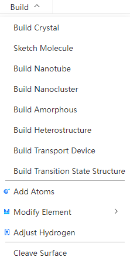

# Build menu
<!--  -->

- [Build Crystal](./qstudio_manual_build_crystal.md)
- [Sketch Molecule](./qstudio_manual_build_molecule.md)
- [Build Nanotube](./qstudio_manual_build_nanotube.md)
- [Build Nanocluster](./qstudio_manual_build_nanocluster.md)
- [Build Amorphous](./qstudio_manual_build_packmol.md)
- [Build Heterostructure](./qstudio_manual_build_hetero.md)
- [Build Transport Device](./qstudio_manual_build_transport.md)
- [Build Transition State Structure](./qstudio_manual_build_neb.md)
  
:::tip NOTE：
For specific modeling operations, see [Modeling Examples](./qstudio_example.md) section
:::

---

- [Add Atoms](./qstudio_manual_build_addatom.md)
- Modify Element: Modify the elements of the selected atom, and support the selection of elements from the periodic table

- Adjust Hydrogen: Automatically adds hydrogen atoms to the selected atom based on elemental and geometric position information

---

- [Cleave surface](./qstudio_manual_build_cleavesurface.md)

