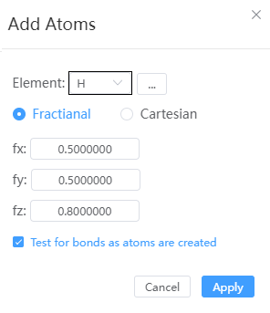

# Add Atoms

- Element: Supports selecting elements from the periodic table
- Fractional, Cartesian: When the structure does not have a lattice, only Cartesian coordinates can be set
- Test for bonds as atoms are created: When selected, the added atom automatically calculates whether it bonds with surrounding atoms