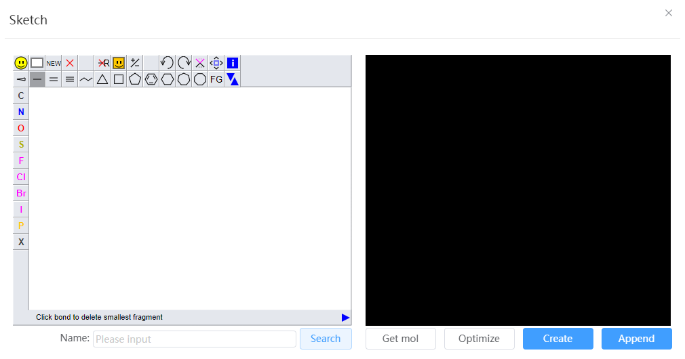

# Sketch Molecule

- Drawing interface: JSME molecular mapping tool, visit [JSME official website](https://jsme-editor.github.io/help.html) for detailed instructions
- Preview interface: After drawing on the JSME interface on the left, a visual model for preview will appear on the right
- Get mol：Export the current small molecule to a file in `.mol` format
- Optimize：Optimize the small molecule structure within the preview interface and automatically hydrogenate
- Create: Create a new window in Q-Studio and import small molecules from the preview interface
- Append: Merges small molecules from the preview interface into structures within Q-Studio's current active window