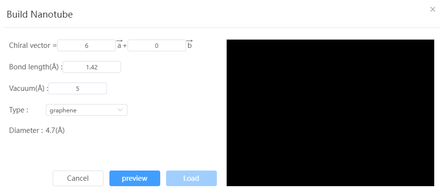

# Build nanotubes

- Chiral vector: Take carbon nanotubes as an example, their structure is a cylinder rolled from graphene, which is characterized by defining the chiral curl vector: *Ch*=*N*·*a* + *M*·*b*, the vectors *a* and *b* are lattice vectors of graphene. In the figure below, the vector OA corresponds to the curl vector when (N, M) = (5,2), and the rectangular OAO'A is a repeating unit of the nanotube, which is rolled into a cylinder to form the nanotube.
  

- Bond Length: Defines either the C-C bond length or the B-N bond length
- Vacuum: The nanotubes will be placed in a periodic lattice, and the spacing of adjacent nanotubes will be set to the size of the vacuum
- Type: Can be graphene or Boron Nitride
- Diameter: Based on the curl vector and bond length, calculate the diameter of the nanotube in angstroms.