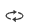

# Shortcut Perspective tool

- ：Reset the perspective
- ：Sets the center of rotation when in observation mode
- ：View onto
- ：View across
- ：The perspective is along the a-axis
- ：The perspective is along the b-axis
- ：The perspective is along the c-axis
- ：The perspective follows the A* (orthogonal to the BC) axis
- ：The perspective follows the b* (orthogonal to the AC axis) axis
- ：The perspective follows the C* (orthogonal to the AB) axis
- ：Automatically rotate the perspective
  
:::tip NOTE：
Use the keyboard `↑` `↓` `←` `→` to rotate the perspective, the rotate degree is defined in the [Translation & Rotation](./qstudio_structtools.md) pop-up
:::
