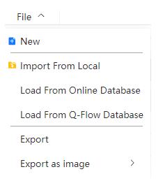
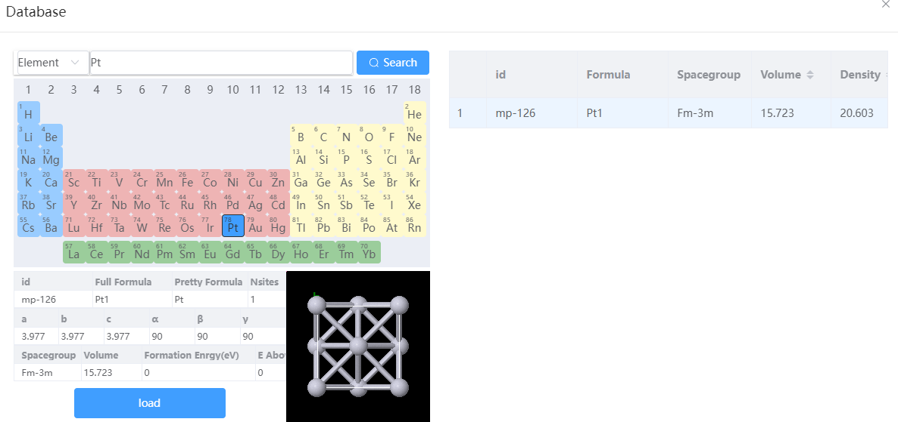
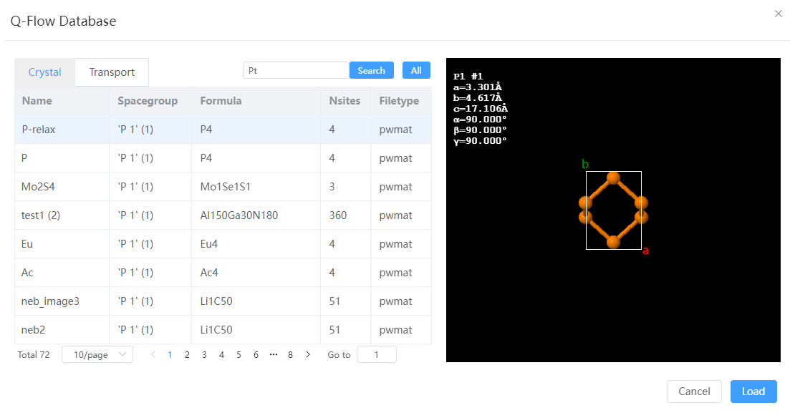
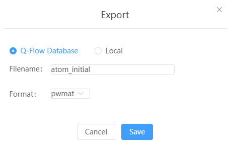

# File Menu

- `New`: Creates a new tab in the structure navigation bar to generate a blank visualization page and activate it
- `Import From Local`: import files from local, periodic system supports `pwmat`, `config`, `cif`, `vasp`, `xsf` formats; Aperiodic systems support `pdb`, `xyz`, `mol` formats; The trajectory animation format supports `xsf`, `MOVEMENT`; The charge density file format supports `XSF`, `JVXL`; Vibrating mode file format supports `band.yaml`
- `Load From Online Database`: The interface to the Materials Project database to search for structures based on elements or chemical formulas and import them into the current window
  
- `Load From Q-Flow Database`: The interface of the Q-Flow structure library, select the structure import in the current window

- `Export`: Exports the current window structure
  - Q-Flow Library: Supports exporting `pwmat`, `cif`, `vasp` formats
  
  - Local: Support exporting `pwmat`, `cif`, `vasp`, `pbd`, `mol` formats
- `Export as image`: Save the current perspective of the current window as an image, support `jpg`, `png` format

