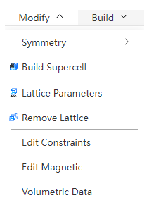
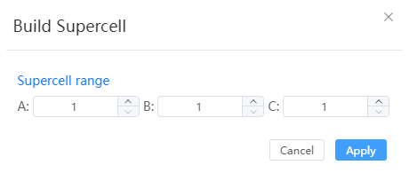

# Modify menu

<!--  -->
<!--  -->

- [Symmetry](./qstudio_manual_settings_symmetry.md)

---

- Build Supercell: Supercell construction of structures with lattice according to periodic boundary conditions

- [Lattice Parameters](./qstudio_manual_settings_latticeconstant.md)
- [Build or Remove Lattice](./qstudio_manual_settings_newlattice.md)

---

- [Edit Constraints](./qstudio_manual_settings_fixatom.md)
- [Edit Magnetic](./qstudio_manual_settings_magmom.md)
- [Volumetric Data](./qstudio_manual_settings_volumedata.md)