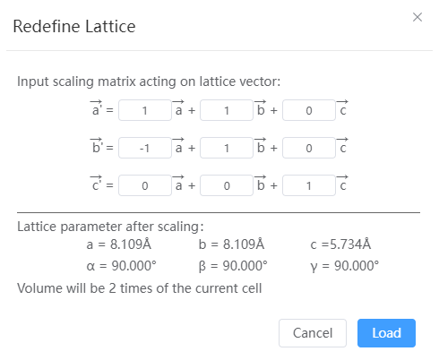

# Redefine Lattice

The lattice vector is redefined on the basis of the existing base vector and the lattice vector is transformed under periodic conditions.

- Input scaling matrix: The new lattice vector matrix after lattice transformation = scaling matrix * original lattice matrix
- Lattice parameters after scaling: shows the lattice constant and volume change after transformation.
- Load: Replaces the existing structure with the transformed structure.