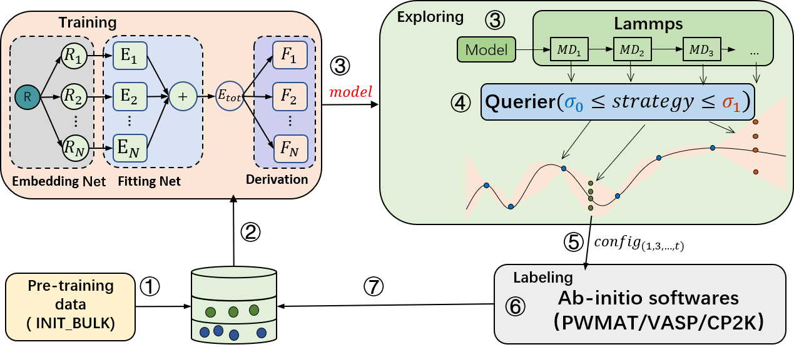

# active learning

"Machine learning force fields (MLFF), compared to traditional methods, can predict material properties and reaction mechanisms faster and more accurately. The current state-of-the-art deep learning-based molecular dynamics can simulate systems with billions of atoms. However, due to the interpolation nature of machine learning methods, MLFFs struggle to make accurate predictions in the phase space outside the training set. Since training data is usually generated using expensive first-principles calculations, it is challenging to obtain a large amount of ab initio data that is both representative and independent of extensive calculations. Improving the extrapolation capability of MLFF models without relying on a large amount of ab initio data is crucial. [`AL-PWMLFF`](https://github.com/LonxunQuantum/PWMLFF_AL/tree/main) (Active learning based on PWMAT Machine Learning Force Field) is an open-source automated active learning platform based on PWMLFF, designed for efficient data sampling."

# AL-PWMLFF
The AL-PWMLFF platform consists of two main components: the main task and the task scheduler, as shown in the architecture diagram.


The main task includes two modules, preparing pre-training data (init_bulk) and active learning (sampling). It is responsible for generating computational tasks and collecting results during the preparation of pre-training data and the active learning process. The task scheduler receives task scheduling requests and assigns tasks to the corresponding computing nodes based on the resource utilization and task resource requirements. After the tasks are executed, the task scheduler collects the execution results from the computing nodes and returns them to the main task program.

### pre-training data preparation module

Includes four sub-modules: relaxation (supporting PWMAT, VASP, CP2K, and DFTB), supercell generation, lattice scaling, lattice perturbation, and running MD (supporting PWMAT, VASP, CP2K, and DFTB). It also supports combinations of these modules.

### active learning module



The active learning module consists of three sub-modules: training, configuration exploration, and annotation (supporting PWMAT, VASP, CP2K, and DFTB). First, the training module performs model training. Then, the trained model is passed to the exploration module, which uses the force field model for molecular dynamics simulations. After the simulation, the molecular motion trajectory is passed to the query module for uncertainty measurement. Once the query is completed, the annotated configuration points are sent to the annotation module. Finally, the annotation module performs self-consistent calculations to obtain energy and forces, which are used as labels along with the corresponding configurations in the annotated database. This process is repeated until convergence.

1. For model training, PWMLFF supports DP model, DP model with compress, and DP model with type embedding.

2. For uncertainty measurement, common methods based on multiple-model committee queries are provided, as well as our latest design, the single-model Kalman Prediction Uncertainty (KPU) based on Kalman filtering. This method can reduce the computational cost of model training to 1/N, where N is the number of models in the committee query, while achieving accuracy close to the committee query. Users are welcome to try this method.

3. For annotation, PWMAT or VASP is supported.

# The pre-training data preparation module 

It includes four sub-modules: relaxation (supporting PWMAT or VASP), supercell generation, lattice scaling, lattice perturbation, and running MD (supporting DFTB, PWMAT, or VASP). It also supports combinations of these modules.

# Dependencies

1. AL-PWMLFF job scheduling uses the [SLURM](https://slurm.schedmd.com/documentation.html) cluster management and job scheduling system. SLURM must be installed on your computing cluster.

2. DFT calculations in AL-PWMLFF support [PWmat](https://www.pwmat.com/gpu-download), [VASP](https://www.vasp.at/), [CP2K](https://www.cp2k.org/) and DFTB. We have integrated DFTB in PWmat. You can find detailed usage instructions in the `DFTB_DETAIL section` of the [`PWmat Manual`](http://www.pwmat.com/pwmat-resource/Manual.pdf).

3. AL-PWMLFF model training is based on [`PWMLFF`](https://github.com/LonxunQuantum/PWMLFF). Refer to the [`PWMLFF documentation`](http://doc.lonxun.com/PWMLFF/Installation) for installation instructions ([`Download address for PWmat version integrated with DFTB`](https://www.pwmat.com/modulefiles/pwmat-resource/mstation-download/cuda-11.6-mstation-beta.zip)).

4. AL-PWMLFF Lammps molecular dynamics simulation is based on [Lammps_for_pwmlff](https://github.com/LonxunQuantum/Lammps_for_PWMLFF/tree/libtorch). Refer to the [`Lammps_for_pwmlff documentation`](https://github.com/LonxunQuantum/Lammps_for_PWMLFF/blob/libtorch/README) for installation instructions.

# Installation Process

### Code Download

    git clone https://github.com/LonxunQuantum/PWMLFF_AL.git

AL-PWMLFF is developed in Python and supports Python 3.9 and above. It is recommended to use the Python runtime environment provided by PWMLFF.

### Required Libraries

If you need to create a virtual environment for AL-PWMLFF separately, you only need to install the following dependent packages (compatible with your Python version, Python >= 3.9).
```bash
    pip install matplotlib numpy pandas tqdm pwdata
```

    
# Command List

AL-PWMLFF includes the following commands, which are not case sensitive. The starting command is `PWact`, and you can also write it as `pwact` or `PWACT`.

### 1. Display the available command list

```bash
PWact  [ -h / --help / help ]
```

### 2. Display the parameter list for cmd_name:

```bash
PWact cmd_name -h
```

### 3. Initial Training Set Preparation

```bash
PWact init_bulk param.json resource.json
```

### 4. Active Learning

```bash
PWact run param.json resource.json
```

For the 3-th and 4-th command above, the names of the JSON files can be modified by the user, but it is required that the input order of [`param.json`](#paramjson) and [`resouce.json`](#resourcejson) cannot be changed.

### 5. Tool Commands

Convert MOVEMENT or OUTCAR to PWdata format

```bash
PWact to_pwdata
```

Search for labeled datasets in the active learning directory

```bash
PWact gather_pwdata
```

## Input Files

AL-PWMLFF requires two input files, `param.json` and `resource.json`, for initial dataset preparation or active learning. AL-PWMLFF is not sensitive to the case input of keys in two JSON files.

### param.json

[Initial Training Set Preparation - init_param.json](./init_param_zh#参数列表)

Configurations (VASP, PWMAT format) for relaxation, supercell, scaling, perturbation, and AIMD (DFTB, PWMAT, VASP) settings.

[Active Learning - run_param.jso](./run_param_zh#参数列表)

Training settings (network structure, optimizer), exploration settings (LAMMPS settings, sampling strategies), and labeling settings (VASP/PWMAT self-consistent calculation settings).

### [resource.json](./resource_zh#resourcejson)

Settings for computational cluster resources, including computing nodes, CPU, GPU resources for training, molecular dynamics (MD), DFT calculations (SCF, Relax, AIMD), and corresponding software (LAMMPS, VASP, PWMAT, PWMLFF).

## Example

### [example of Si](./example_si_init_zh)
