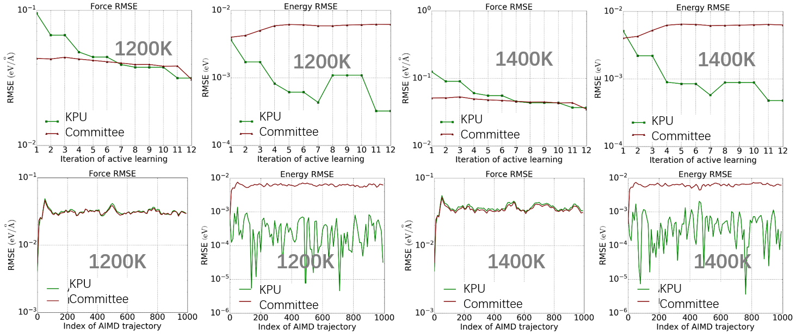
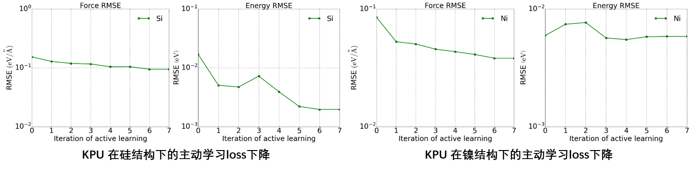

# 3. Active Learning
[PWact](../active%20learning/README.md) (Active learning based on PWMLFF) is an open-source automated active learning platform based on PWMLFF that we developed for efficient data sampling. PWact implements commonly used committee query-based active learning strategies, as well as our Kalman Prediction Uncertainty (KPU) algorithm, which we proposed based on the Kalman filter. KPU-based active learning is still in the testing phase and not yet available to users. In this example, we compare two active learning sampling methods.

## Two Active Learning Methods for Copper Structures

Active learning sampling was conducted using the following structures:

  

    
    
Copper

  

  

    
    
Silicon

  

  

    
    
Nickel

  

### Data Collection Details for Each Active Learning Round

### Loss Reduction in Each Active Learning Round

Using 1000 steps/2fs AIMD (PWmat) trajectories at 1200K and 1400K as the validation set, we analyzed the error reduction trend as new data was added during active learning. The force error for both KPU and Committee gradually decreased, while the energy error for the Committee did not decline. This could be due to the point selection method based on the maximum force deviation in the Committee approach, which favored force prediction and resulted in some inaccuracies in energy prediction being missed. In the validation set, the final model errors for KPU and Committee, as shown in the four graphs in the second row, indicated that the energy errors for KPU and Committee were similar, but KPU had a lower energy error than the Committee.

### KPU Testing on Silicon and Nickel

We also conducted active learning tests on silicon and nickel using KPU, with results shown in the figure. As the active learning rounds progressed, the model gradually covered the phase space of the test set.

### Phonon Spectra for Copper, Silicon, and Nickel

We plotted the phonon spectra for the final models obtained using KPU, as shown in the figure below.

