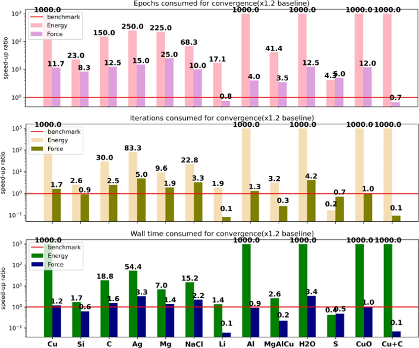

# 2. LKF And ADAM
[[Paper RLKEKF]](https://arxiv.org/abs/2212.06989)

The article proposes a `Recurrent Layer Extended Kalman Filter (LKF)` optimizer aimed at accelerating the training of neural network force fields. LKF is an improved version of the Global Extended Kalman Filter (GKF), employing a strategy of splitting large layers and aggregating small layers to reduce computational cost. This approach uses a sparse diagonal block matrix to approximate the dense weight error covariance matrix, thereby enhancing computational efficiency. The authors conducted numerical experiments on `13` common systems and compared LKF with the ADAM optimizer. The experimental results demonstrate that LKF `converges faster and is slightly more accurate` than ADAM. Additionally, the authors theoretically proved the convergence of the weight updates, overcoming the problem of gradient explosion. Overall, LKF is insensitive to weight initialization and performs well in training neural network force fields.

## Partial Experimental Results

### Fitting Accuracy

Performance of LKF compared to DFT in terms of energy (meV) and force (meV/Å) for each structure in various systems (the closer the points are to the diagonal, the better the performance). The RMSE of Etot; Eatom and F on the test set, with the structure of the system shown in the bottom right corner of each subplot.

### Training Time (VS ADAM)

Speed comparison of LKF and Adam in reaching the accuracy baseline for energy and force based on epochs, iterations (weight updates), and wall-clock time, where 1000 indicates that Adam could not reach the baseline.