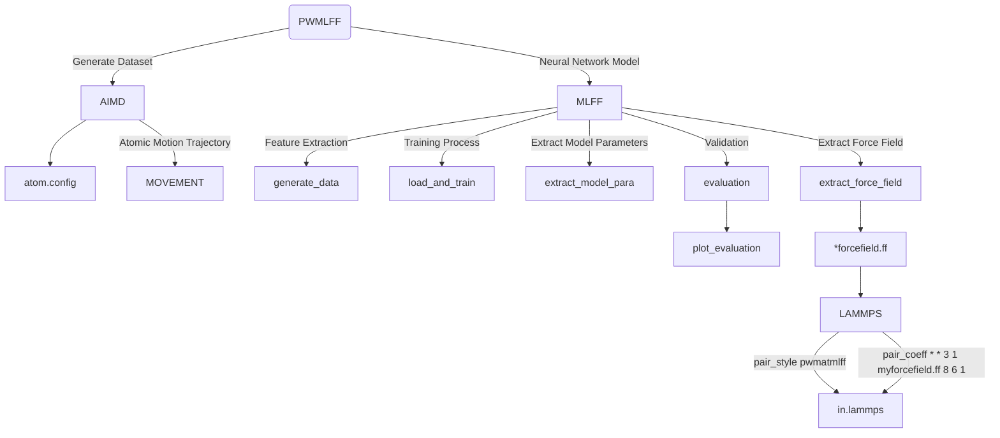

# Molecule Ethylene Carbonate System

The following example, based on an isolated C3H4O3 system, demonstrates how to train and use the **PWMLFF Neural Network Model** for prediction.

The overall program workflow is roughly divided into:



## 1. Generating the Dataset

Using the C3H4O3 data obtained from a PWmat AIMD simulation, the data file `MOVEMENT` contains 200 structures, each consisting of 10 atoms.

**Sample `etot.input` File:**

```bash
8  1   
JOB = MD
MD_DETAIL = 2 200 1 400 400
XCFUNCTIONAL = PBE
Ecut = 60
ECUT2 = 240
MP_N123 = 1 1 1 0 0 0 3
ENERGY_DECOMP = T
OUT.STRESS = F
IN.ATOM = atom.config
IN.PSP1 = C.SG15.PBE.UPF
IN.PSP2 = H.SG15.PBE.UPF
IN.PSP3 = O.SG15.PBE.UPF
```

- Optional `ENERGY_DECOMP`: Whether to decompose the total DFT energy into atomic energies (atomic energy). The results are output in the `MOVEMENT` file. To use or train atomic energy, set this to `T`.
- Optional `OUT.STRESS`: Whether to output stress information. To train `Virial`, set this to `T`.
- Other parameter details can be found in the [PWmat manual](http://www.pwmat.com/pwmat-resource/Manual.pdf).

## 2. Training Process

### 2.1 Feature Extraction

Create a new directory and place the `MOVEMENT*` files there. Alternatively, these files can be located in other directories, and you can adjust the `train_movement_path` in the `*.json` input file accordingly.

### 2.2 Training Input File

In the current directory, create a new `*.json` file (e.g., `nn_ec.json`). This file will contain a series of required parameters.

**Example Input File ([Details on Other Parameters](#5-Input-File-Parameter-Details)):**

```json
{   
    "train_movement_file":["./EC_MOVEMENT"],

    "model_type": "NN",
    "atom_type":[8,6,1]
}
```

- `train_movement_file`: Name of the `MOVEMENT` file(s). Multiple files can be specified. Adjust according to your setup.
- `model_type`: Model type, referring to the model used for training. Other models and parameter configurations are detailed in [Parameter Details](../../../Parameter%20details.md).
- `atom_type`: Specifies the atomic types, where 8, 6, and 1 correspond to O, C, and H atomic numbers, respectively.

### 2.3 Running the Program

The following slurm script example is suitable for Mcloud. Ensure that the necessary environment and modules are loaded when submitting the job.

```bash
#!/bin/sh
#SBATCH --partition=3080ti
#SBATCH --job-name=mlff
#SBATCH --nodes=1
#SBATCH --ntasks-per-node=1
#SBATCH --gres=gpu:1
#SBATCH --gpus-per-task=1

#Mcloud installed environment loaded
# Recommended here
source /share/app/PWMLFF/PWMLFF2024.5/env.sh
# Alternatively, the following method can be used for step-by-step loading
# source /share/app/anaconda3/etc/profile.d/conda.sh
# module load conda/3-2020.07
# conda deactivate
# conda activate PWMLFF
# module load pwmlff/2024.5

PWMLFF train nn_ec.json > log
```

To run interactively:

```bash
$ srun -p 3080ti --gres=gpu:1 --pty /bin/bash

$ source /share/app/PWMLFF/PWMLFF2024.5/env.sh

$ PWMLFF train nn_ec.json
```

:::tip
Generating features and training can be run separately:

- `PWMLFF gen_feat nn_ec.json` - Only used to generate features.
- `PWMLFF train nn_ec.json` - Loads and processes features before starting training. Running `train` directly will automatically call `gen_feat`. If `gen_feat` has already been run, you can set the `train_feature_path` in the `.json` file to specify the feature path, and comment out `train_movement_file`.
:::

---

After running the program, the `forcefield` and `model_record` directories will be generated in the execution directory:

```
EC_system/
└── dir
    ├── forcefield
    │   ├── forcefield.ff
    │   ├── fread_dfeat            
    │   │   ├── data_scaler.txt           
    │   │   ├── feat.info            
    │   │   ├── vdw_fitB.ntype            
    │   │   └── Wij.txt     
    │   ├── input          
    │   │   ├── (egroup.in)  # Only works when ATOMIC ENERGY exists in the MOVEMENT
    │   │   └── *feature.in     
    │   └── (output)                     
    │       └── grid*   # Used when feature 1, 2 is applied
    │
    └── model_record
    │   ├── epoch_train.dat     # Training error for each epoch
    │   ├── epoch_valid.dat     # Validation error for each epoch
    │   ├── iter_train.dat      # Training error for each batch     
    │   ├── iter_valid.dat      # Validation error for each batch     
    │   ├── nn_model.ckpt       # Model file   
    │   └── scaler.pkl          # Extracting scaler values of the model
```

:::info epoch_loss.dat & epoch_loss_valid.dat


- `loss` corresponds to the total training error.
- `RMSE_Etot` corresponds to the energy error during training.
- `RMSE_F` corresponds to the force error during training.

<font color='red'>If the training set error is significantly lower than the validation set error, it indicates overfitting. Consider increasing the training set size or adjusting the batch size.</font>

:::

## 3. Validation/Testing

After training is complete, you can validate or test the model to assess its fitting performance.

Create a new directory (e.g., `MD`) and copy another `MOVEMENT` file into this directory. Then, set the `test_movement_file` and `test_dir_name` parameters in the `.json` file, and add the `model_load_file` parameter.

**Relevant Input Example:**

```json
    "test_movement_file":["./MD/MOVEMENT"],
    "test_dir_name":"test_dir",
    "model_load_file":"./model_record/nn_model.ckpt",
```

**Example of Running Validation:**

Change `train` to `test` in `PWMLFF train nn_ec.json`:

```bash
PWMLFF test nn_ec.json
```

After running the program, validation results will be stored in the directory specified by `test_dir_name`.

## 4. LAMMPS Simulation

The generated `*.ff` force field file can be used for LAMMPS simulation (requires a recompiled [version](https://github.com/LonxunQuantum/Lammps_for_PWMLFF)).

To use the force field file generated by PWMLFF, include the following in the LAMMPS input file:

```bash
pair_style      pwmatmlff
pair_coeff      * * 3 1 forcefield.ff 8 6 1
```

Here, `3` indicates the use of the Neural Network model, `1` specifies reading one force field file, `forcefield.ff` is the name of the PWMLFF-generated force field file, and `8`, `6`, `1` are the atomic numbers for O, C, and H, respectively.

Example LAMMPS input file (NVT ensemble):

```bash
units           metal
boundary        p p p
atom_style      atomic
processors      * * *
neighbor        2.0 bin
neigh_modify    every 10 delay 0 check no

read_data       POSCAR.lmp

pair_style      pwmatmlff
pair_coeff      * * 3 1 forcefield.ff 8 6 1
velocity        all create 300 206952 dist gaussian
timestep        0.001
fix             1 all nvt temp 300 300 0.1
thermo_style    custom step pe ke etotal temp vol press
thermo          1
dump            1 all custom 1 traj.xyz id type x y z vx vy vz fx fy fz
run             1000 
```

## 5. Input File Parameter Details
```json
{   
    "recover_train":false,
    "work_dir":"./work_train_dir",
    "reserve_work_dir": false,
   
    "train_movement_file":["./PWdata/MOVEMENT"],

    "forcefield_name": "forcefield.ff",
    "forcefield_dir": "forcefield",

    "test_movement_file":["./MD/MOVEMENT"],
    "test_dir_name":"test_dir",

    "train_valid_ratio":0.8,

    "model_type": "NN",
    "atom_type":[8,6,1],
    "feature_type":[7],
    "max_neigh_num":100, 
    "model":{
        "fitting_net": {
            "network_size": [15, 15, 1]
        },
        "descriptor": {
            "Rmax":6.0, 
            "Rmin":0.5,            
            
            "1":{
                "numOf2bfeat": 24,
                "iflag_grid": 3,
                "fact_base": 0.2,
                "dR1": 0.5,
                "iflag_ftype": 3
            },
            "2":{
                "numOf3bfeat1" : 3,
                "numOf3bfeat2" : 3,
                "iflag_grid" : 3,
                "fact_base" : 0.2,
                "dR1" : 0.5,
                "dR2" : 0.5,
                "iflag_ftype" : 3
            },
            "3":{
                "n2b": 6,
                "w": [1.0, 1.5, 2.0]
            },
            "4":{
                "n3b": 20,
                "zeta": 2.0,
                "w": [0.5, 1.0, 1.5, 2.0, 2.5, 3.0, 3.5, 4.0, 4.5, 5.0]
            },
            "5":{
                "n_MTP_line":5
            },
            "6":{
                "J":3.0,
                "n_w_line":2,
                "w1":[0.9, 0.1, 0.8, 0.2, 0.7, 0.3, 0.6, 0.4],
                "w2":[0.1, 0.9, 0.2, 0.8, 0.3, 0.7, 0.3, 0.6]
            },
            "7":{
                "M":25,
                "M2":4,
                "weight_r":1.0
            },
            "8": {
                "M":8,
                "weight_r":1.0,
                "w":[1.0, 1.5, 2.0, 2.5]
            }
        }
    },

    "optimizer":{
        "optimizer":"LKF",
        "block_size":5120, 
        "kalman_lambda":0.98, 
        "kalman_nue":0.99870,
        "nselect":24,
        "groupsize":6,
        
        "batch_size": 1,
        "epochs":5,
        "start_epoch":1,

        "print_freq":10,

        "train_energy":true,
        "train_force":true,
        "train_ei":false,
        "train_virial":false,
        "train_egroup":false,
    
        "pre_fac_force":2.0,
        "pre_fac_etot":1.0, 
        "pre_fac_ei":1.0,
        "pre_fac_virial":1.0, 
        "pre_fac_egroup":0.1
        
        }
}

```

- `recover_train`: Whether to continue training from the last interruption/completion. If set to `true`, the program will resume training from the last interruption/completion point using the default `model_load_path` and `model_name`. See [Parameter Details](../../../Parameter%20details.md) for more information.
- `work_dir`: Directory for storing intermediate files during training. This directory is automatically deleted after training completes. If `reserve_work_dir` is set to `true`, the directory will not be deleted after training.
- `train_movement_file`: Name of the `MOVEMENT` file(s). Multiple files can be specified. Adjust according to your needs.
- `forcefield_name`: Name of the generated force field file. This is optional.
- `forcefield_dir`: Directory for storing the generated force field file. This is optional.
- `test_movement_file`: `MOVEMENT` file used for validating the model after training is complete. ([Details on Validation/Testing](#3-Validation-Testing))
- `test_dir_name`: Directory for storing the `MOVEMENT` file used for model validation after training.
- `model_type`: Model type being used for training. For other model types and parameter configurations, refer to [Parameter Details](../../../Parameter%20details.md).
- `atom_type`: Atomic types, where 8, 6, and 1 correspond to the atomic numbers of O, C, and H, respectively.
- `max_neigh_num`: Maximum number of neighboring atoms.
- `model`: Model parameters. For specific parameter configurations, refer to [Parameter Details](../../../Parameter%20details.md).
- `Rmax`: Maximum cutoff radius for features.
- `Rmin`: Minimum cutoff radius for features.
- `feature_type`: Type of feature, where 7 corresponds to DP-Chebyshev features. See [Feature Types](../../../Appendix-1.md) for details.
- `optimizer`: Optimizer parameters, with `LKF` recommended. Generally, for large systems and networks, using the `LKF` optimizer can speed up training. For other optimizers and additional parameter configurations, refer to [Parameter Details](../../../Parameter%20details.md).
- `epochs`: Number of training iterations. Adjust based on the total number of images in the `MOVEMENT` file. For fewer images, you may increase this number, e.g., to 30.