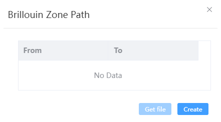
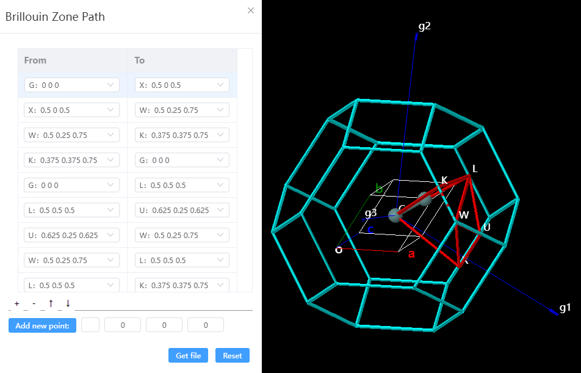
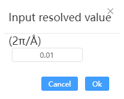

# Brillouin Zone Path

Based on the lattice parameters and space group information, the reciprocal lattice vector, the first Brillouin zone, and the high symmetry points and their paths are visualized. After editing the high symmetry point path, you can export it to a high symmetry point path file in PWmat format.

- Create: After clicking, visualize the reciprocal lattice vector, the first Brillouin zone, and return the automatically generated high symmetry points and their path information.
  

- Adjust the path: Click '+', '-' to add and delete the path, and click '↑', '↓' to move up and down the path. After entering the special K point symbol and location. Click `Add new point` to add a new special K point, then you can choose this point when editing the path.
  
- Get file: Input the resolved value between kpoints and click `Ok` to export the high symmetry point path file gen.kpt.

