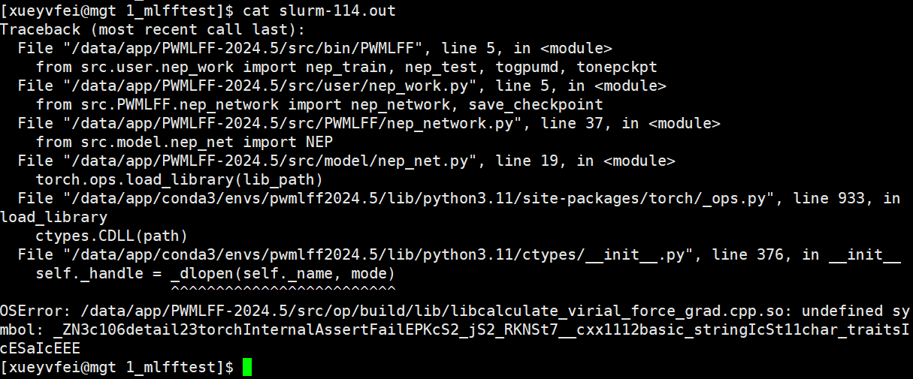

# Install Error

## About the Compilation Environment

Most installation failures are due to version mismatches in the compilation environment or missing relevant environment variables. Please ensure that the following compilers are correctly installed and that their versions are compatible.

We recommend using `intel2020` version, `cuda/11.8`, `cmake version >= 3.21`, and `gcc version 8.n`. The `pytorch` version used in PWMLFF is `2.0` or higher, and it must be used with `cuda/11.8` or a newer version.

## 1. OSError

### Environment Description

Operating system: `rocky8.5`, `cmake 2.30.0`, `gcc8.5` or `gcc9.2`, `cuda/11.8`, `intel/2020`, `pytroch 2.2.0.dev20231127+cu118`, `PWMLFF2024.5`

### Error Description

This error occurs on the Rocky8.5 operating system (it may also occur on Ubuntu). After successfully compiling PWMLFF2024.5 following the installation instructions, the following error occurs when submitting a task for training.

```plaintext
OSError: /PWMLFF2024.5/src/op/build/lib/libcalculate_virial_force_grad.cpp.so: undefined symbol: _ZN3c106detail23torchInternalAssertFailEPKcS2_jS2_RKNSt7__cxx1112basic_stringIcSt11char_traitsIcESaIcEEE
```



### Solution

In the source directory `/PWMLFF2024.5/src/op`, modify the `CMakeLists.txt` file and uncomment the first line (remove the `#` character):

```txt
add_compile_options(-D_GLIBCXX_USE_CXX11_ABI=0)
```

### Cause of the Error

This error is caused by an ‌ABI (Application Binary Interface) mismatch for `std::string`. ‌The `std::string` ABI issue mainly involves compatibility problems with the `std::string` class in the C++ standard library across different compiler ABIs. ABI defines the binary-level specifications of a program, including function call conventions, data type layouts, exception handling mechanisms, etc., and is determined by the compiler, operating system, and hardware. Because the C++ ABI is more complex than the C language, it depends on the compiler. Therefore, when programs are compiled with different compilers or different versions of the same compiler, ABI incompatibility may occur.

For CentOS systems, after installing `pytorch` via pip, the `_GLIBCXX_USE_CXX11_ABI` macro of `libtorch` is set to 1, matching the value used when compiling C++ CUDA operators. However, on Rocky8.5 or Ubuntu systems, the `libtorch` macro is 0, which no longer matches, leading to this error. You need to manually specify it as 0 in the `CMakeLists.txt` file.

---