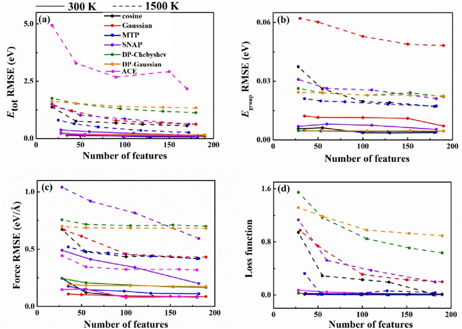
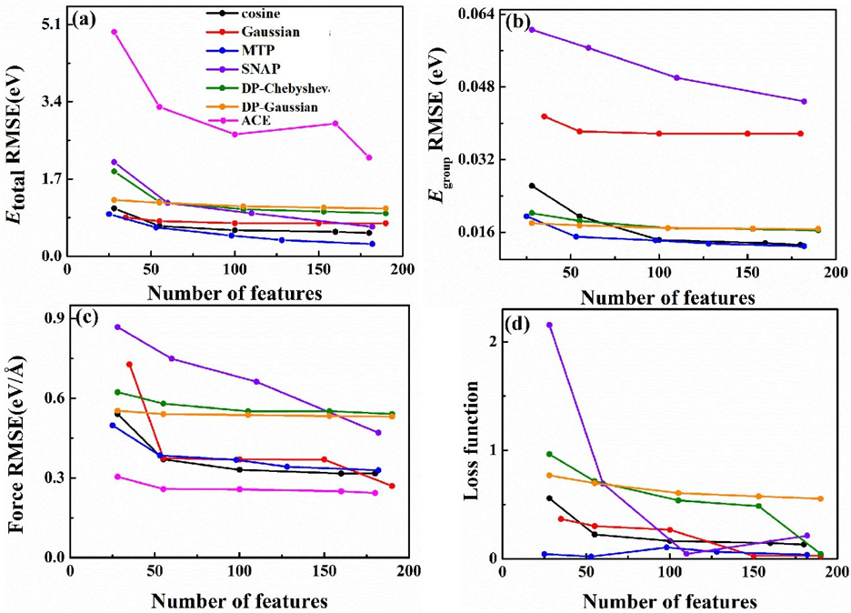

# 1. Comparison of Features

#
[[Paper Accuracy evaluation of different machine learning force field features]](https://iopscience.iop.org/article/10.1088/1367-2630/acf2bb/pdf)

#
This work compares the differences in the ability of `feature types in PWMLFF` to describe physical systems. These feature types include `cosine features`, `Gaussian features`, `moment tensor potential (MTP) features`, `spectral neighbor analysis potential (SNAP) features`, `simplified smooth deep potential with Chebyshev polynomial features` and `Gaussian polynomial features`, and `atomic cluster expansion features`. For a detailed introduction to the features, please refer to [[Feature Wiki]](../Appendix-1.md).

#
### DFT Data

For the sulfur system, NVT AIMD simulations were performed at 300K and 1500K, and molecular dynamics simulations were conducted for 2 ps at 300K. These simulations yielded 2000 structures at 300K. For 1500K, a 3 ps molecular dynamics simulation was followed by a 2 ps AIMD simulation, resulting in the training dataset at 1500K. The sulfur ring broke during the simulation, presenting a system structure with broken bonds.

For the carbon system, four different carbon structural phases were selected, and NVT AIMD simulations were performed from 300K to 3500K. To cover a broader configuration space, high-temperature simulation results at 3500K were also included in the training dataset. Each carbon phase was simulated for 1000 steps, yielding a total of 4000 structures as the training dataset.

|    System     | Description   | Temperature (K) | Steps (fs) |
|:-------------:|:-------------:|:----------------:|:----------:|
|  Sulfur-300 K | α-S 128 atoms |        300       |    2000    |
| Sulfur-1500 K |   128 atoms   |       1500       |    2000    |
|    Diamond    |    64 atoms   |      300–3500    |    1000    |
|   Graphene    |    64 atoms   |      300–3500    |    1000    |
|  Graphenylene |    64 atoms   |      300–3500    |    1000    |
|    M-carbon   |    64 atoms   |      300–3500    |    1000    |

 **Details of the sulfur and carbon systems and their AIMD steps**

#
### Partial Experimental Results

Training errors for different feature types on the Sulfur-300 K dataset (solid line) and Sulfur-1500 K dataset (dashed line) for (a) total energy, (b) atomic energy, (c) force, and (d) loss function.

<!-- 

Training errors for the combined Sulfur-300 K and Sulfur-1500 K datasets and different feature types for (a) total energy, (b) atomic energy, (c) force, and (d) loss function. -->

Training errors for different feature types on the combined carbon system datasets for (a) total energy, (b) atomic energy, (c) force, and (d) loss function.