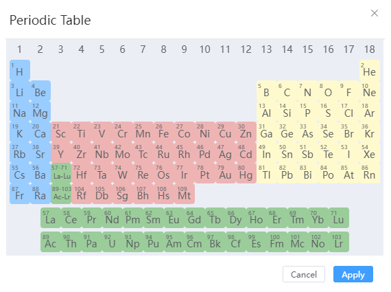

# Build menu
<!--  -->

- [Build Crystal](/en/next/Q-Studio/界面及功能/菜单/qstudio_manual_build_crystal)
- [Sketch Molecule](/en/next/Q-Studio/界面及功能/菜单/qstudio_manual_build_molecule)
- [Build Nanotube](/en/next/Q-Studio/界面及功能/菜单/qstudio_manual_build_nanotube)
- [Build Nanocluster](/en/next/Q-Studio/界面及功能/菜单/qstudio_manual_build_nanocluster)
- [Build Amorphous](/en/next/Q-Studio/界面及功能/菜单/qstudio_manual_build_packmol)
- [Build Heterostructure](/en/next/Q-Studio/界面及功能/菜单/qstudio_manual_build_hetero)
- [Build Transport Device](/en/next/Q-Studio/界面及功能/菜单/qstudio_manual_build_transport)
- [Build Transition State Structure](/en/next/Q-Studio/界面及功能/菜单/qstudio_manual_build_neb)
  
:::tip NOTE：
For specific modeling operations, see [Modeling Examples](/en/next/Q-Studio/建模示例/qstudio_example_2d) section
:::

---

- [Add Atoms](/en/next/Q-Studio/界面及功能/菜单/qstudio_manual_build_addatom)
- Modify Element: Modify the elements of the selected atom, and support the selection of elements from the periodic table

- Adjust Hydrogen: Automatically adds hydrogen atoms to the selected atom based on elemental and geometric position information

---

- [Cleave surface](/en/next/Q-Studio/界面及功能/菜单/qstudio_manual_build_cleavesurface)

