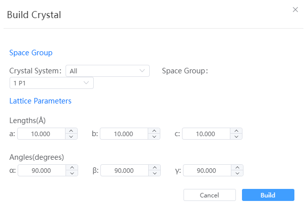

# Build Crystal

- Space Group: You can choose the crystal system, as well as the space group under different crystal systems
- Lattice Parameters: Some elements will be modified according to the requirements of the crystal system for the lattice constant. For example, in the cubic crystal system, only `a` can be modified, at which time `a`=`b`=`c`; `α`=`β`=`γ`=90°