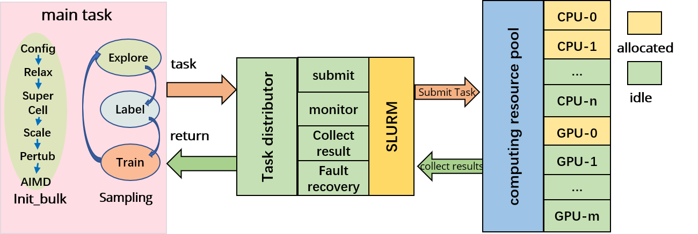
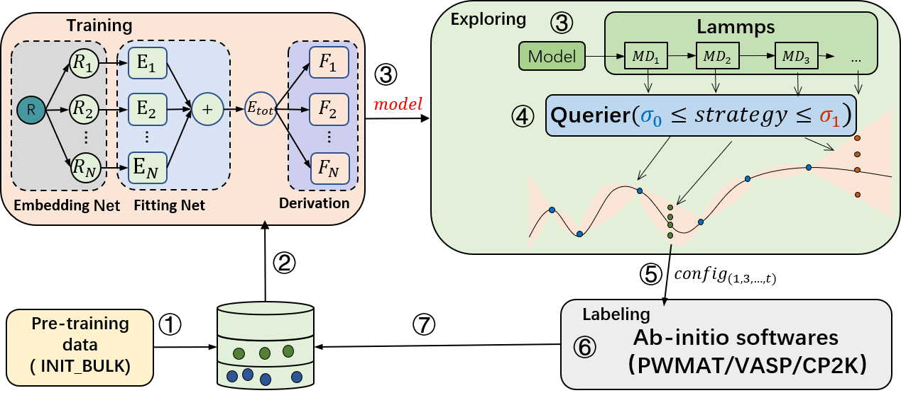

# active learning

"Machine learning force fields (MLFF), compared to traditional methods, can predict material properties and reaction mechanisms faster and more accurately. The current state-of-the-art deep learning-based molecular dynamics can simulate systems with billions of atoms. However, due to the interpolation nature of machine learning methods, MLFFs struggle to make accurate predictions in the phase space outside the training set. Since training data is usually generated using expensive first-principles calculations, it is challenging to obtain a large amount of ab initio data that is both representative and independent of extensive calculations. Improving the extrapolation capability of MLFF models without relying on a large amount of ab initio data is crucial. [`PWact`](https://github.com/LonxunQuantum/PWact) (Active learning based on PWMAT Machine Learning Force Field) is an open-source automated active learning platform based on PWMLFF, designed for efficient data sampling."

# AL-PWMLFF
The AL-PWMLFF platform consists of two main components: the main task and the task scheduler, as shown in the architecture diagram.



The main task includes two modules, preparing pre-training data (init_bulk) and active learning (sampling). It is responsible for generating computational tasks and collecting results during the preparation of pre-training data and the active learning process. The task scheduler receives task scheduling requests and assigns tasks to the corresponding computing nodes based on the resource utilization and task resource requirements. After the tasks are executed, the task scheduler collects the execution results from the computing nodes and returns them to the main task program.

### pre-training data preparation module

Includes four sub-modules: relaxation (supporting PWMAT, VASP, CP2K), supercell generation, lattice scaling, lattice perturbation, and running MD (supporting PWMAT, VASP, CP2K). It also supports combinations of these modules.

### active learning module



The active learning module consists of three sub-modules: training, configuration exploration, and annotation (supporting PWMAT, VASP, CP2K). First, the training module performs model training. Then, the trained model is passed to the exploration module, which uses the force field model for molecular dynamics simulations. After the simulation, the molecular motion trajectory is passed to the query module for uncertainty measurement. Once the query is completed, the annotated configuration points are sent to the annotation module. Finally, the annotation module performs self-consistent calculations to obtain energy and forces, which are used as labels along with the corresponding configurations in the annotated database. This process is repeated until convergence.

1. For model training, PWMLFF supports DP model, DP model with compress, DP model with type embedding and NEP(NEP4) model.

2. For uncertainty measurement, common methods based on multiple-model committee queries are provided, as well as our latest design, the single-model Kalman Prediction Uncertainty (KPU) based on Kalman filtering. This method can reduce the computational cost of model training to 1/N, where N is the number of models in the committee query, while achieving accuracy close to the committee query. Users are welcome to try this method. For the KPU method, it is only applicable to the DP model.

3. For annotation, PWMAT or VASP is supported.

# The pre-training data preparation module 

It includes four sub-modules: relaxation (supporting PWMAT or VASP), supercell generation, lattice scaling, lattice perturbation, and running MD (PWMAT, or VASP). It also supports combinations of these modules.

# Dependencies

1. AL-PWMLFF job scheduling uses the [SLURM](https://slurm.schedmd.com/documentation.html) cluster management and job scheduling system. SLURM must be installed on your computing cluster.

2. DFT calculations in AL-PWMLFF support [PWmat](https://www.pwmat.com/gpu-download), [VASP](https://www.vasp.at/), [CP2K](https://www.cp2k.org/)

3. AL-PWMLFF model training is based on [`PWMLFF`](https://github.com/LonxunQuantum/PWMLFF). Refer to the [`PWMLFF documentation`](http://doc.lonxun.com/PWMLFF/Installation) for installation instructions .

4. AL-PWMLFF Lammps molecular dynamics simulation is based on [Lammps_for_pwmlff](https://github.com/LonxunQuantum/Lammps_for_PWMLFF/tree/libtorch_nep). Refer to the [`Lammps_for_pwmlff documentation`](https://github.com/LonxunQuantum/Lammps_for_PWMLFF/tree/libtorch_nep/README) for installation instructions.

# Installation Guide

PWact supports two installation methods: pip command installation and source code installation.

### 1. Pip Command Installation
Source Code Download
```bash
git clone https://github.com/LonxunQuantum/PWact.git
or
git clone https://gitee.com/pfsuo/pwact.git
The Gitee repository may not be updated as promptly as GitHub, so it is recommended to download from GitHub.
```

After downloading the source code, navigate to the root directory (at the same level as `setup.py`) and run the following command:
```bash
pip install .
# Or use the developer option, which installs without copying files. It reads directly from the source files, meaning any changes to the source code will take effect immediately. This is useful for users who need to modify the source code themselves.
# pip install -e .
```

PWact is developed in Python and supports Python 3.9 and above. It is recommended to use the [Python runtime environment](http://doc.lonxun.com/PWMLFF/Installation) of PWMLFF directly.

If you need to create a separate virtual environment for PWact, you only need to install the following dependencies (matching your Python version, supporting Python 3.9 and above).
```bash
pip install numpy pandas tqdm pwdata
```


# Command List

PWact includes the following commands, starting with the command `pwact`.

### 1. Output a list of available commands

```bash
pwact  [ -h / --help / help ]
```
You can also use this command to check if PWact is installed successfully.
### 2. Output the parameter list for cmd_name

```bash
pwact cmd_name -h
```

### 3. Prepare initial training set

```bash
pwact init_bulk param.json resource.json
```

### 4. Active Learning

```bash
pwact run param.json resource.json
```

For the above two commands, the names of the json files can be changed by the user, but the order of input for [`param.json`](#paramjson) and [`resouce.json`](#resourcejson) must remain the same.

### 5. Tool Commands
<!-- MOVEMENT or OUTCAR conversion to PWdata data format

```bash
# Command to convert MOVEMENT to pwdata format using pwact
pwact to_pwdata -i mvm_init_000_50 mvm_init_001_50 mvm_init_002_50 -s pwdata -f pwmat/movement -r -m -o 0.8
# -i List of structure files
# -f Format of the structure files, supports pwmat/movement or vasp/outcar
# -s Name of the directory to save data
# -r Specify random shuffling of the saved data
# -m Specify merging of the converted data. If your MOVEMENT files contain the same element types and number of atoms, you can use this option to save the training set as a single folder
# -o Specify the training and test set split ratio, default is 0.8
``` -->

#### gather_pwdata

Searches all structures explored under the active learning directory and converts the results into a pwmlff/npy format training set.

```bash
pwact gather_pwdata -i .
```
Here, `-i` specifies the path to the active learning directory.

#### kill

Terminates an ongoing `init_bulk` task, such as relaxation (relax) or AIMD tasks.

```bash
# Navigate to the directory where the pwact init_bulk command was executed
pwact kill init_bulk
```

Terminates an ongoing `run` task, including running training, exploration (MD), or labeling tasks.

```bash
# Navigate to the directory where the pwact run command was executed
pwact kill run
```

The above `kill` commands can also be replaced by manual operations. First, terminate the main process executing `pwact init_bulk` or `pwact run`. Second, manually end the ongoing SLURM tasks.

To avoid accidentally terminating other processes, it is recommended to use the commands for termination.

After using the command to terminate processes, it is recommended to review the command output and use SLURM commands to check for any remaining processes.

#### filter

Test the point selection under specified lower and upper limits.

```bash
pwact filter -i iter.0000/explore/md -l 0.01 -u 0.02 -s 
```

This command will analyze the selection results from all trajectories explored in the `iter.0000/explore/md` directory using a lower limit of 0.01 and an upper limit of 0.02 (as shown in the example below). The `-s` option is optional and specifies whether to save detailed selection information.

```txt
Image select result (lower 0.01 upper 0.02):
 Total structures 972    accurate 20 rate 2.06%    selected 44 rate 4.53%    error 908 rate 93.42%

Select by model deviation force:
Accurate configurations: 20, details in file accurate.csv
Candidate configurations: 44
        Select details in file candidate.csv
Error configurations: 908, details in file fail.csv
```

## Input Files

AL-PWMLFF requires two input files, `param.json` and `resource.json`, for initial dataset preparation or active learning. AL-PWMLFF is not sensitive to the case input of keys in two JSON files.

### param.json

[Initial Training Set Preparation - init_param.json](./init_param_zh#参数列表)

Configurations (VASP, PWMAT format) for relaxation, supercell, scaling, perturbation, and AIMD (PWMAT, VASP) settings.

[Active Learning - run_param.jso](./run_param_zh#参数列表)

Training settings (network structure, optimizer), exploration settings (LAMMPS settings, sampling strategies), and labeling settings (VASP/PWMAT self-consistent calculation settings).

### [resource.json](./resource_zh#resourcejson)

Settings for computational cluster resources, including computing nodes, CPU, GPU resources for training, molecular dynamics (MD), DFT calculations (SCF, Relax, AIMD), and corresponding software (LAMMPS, VASP, PWMAT, PWMLFF).

## Example

### [example of Si](./example_si_init_zh)
