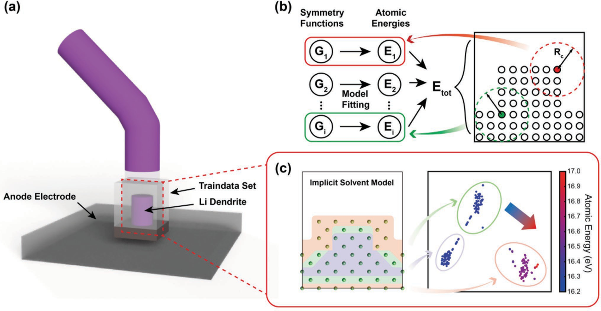
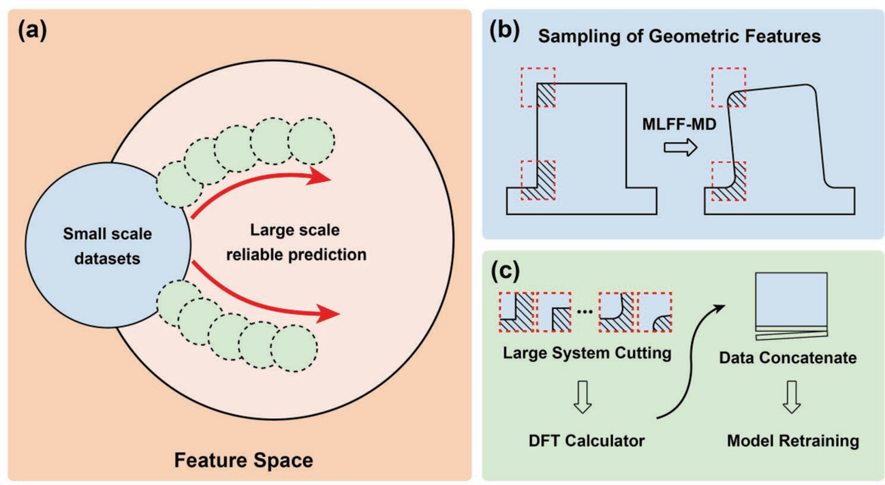
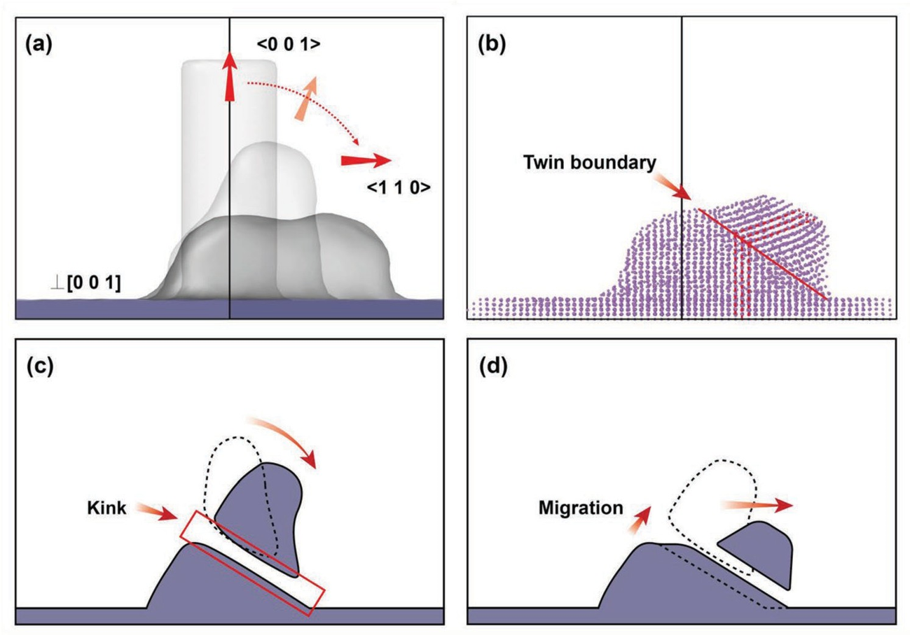

# 7. Morphology Evolution of Lithium Dendrites
For case details, please refer to the [[LongXun official account article]](https://mp.weixin.qq.com/s/kapzIrPvL2AcGTUzdHgglg) and the [[Revealing Morphology Evolution of Lithium Dendrites by Large-Scale Simulation Based on Machine Learning Force Field ]](https://iopscience.iop.org/article/10.1088/1367-2630/acf2bb)

Lithium-ion batteries, known for their high energy density, are widely used in electric vehicles, large-scale energy storage systems, and more. Lithium metal anodes, due to their lowest chemical potential and high capacity, are promising for next-generation batteries with higher energy densities. However, during charging and discharging cycles, lithium metal anodes tend to develop dendritic growth and experience significant volume changes, severely affecting their application. In practical use, lithium dendrite growth can greatly reduce the Coulombic efficiency, energy density, and stability of batteries. When the dendrites grow long enough, they can pierce the separator, directly contacting the cathode and causing short circuits, which may lead to serious incidents such as fires. Therefore, solving the dendrite growth problem is crucial in the development of lithium metal anode materials.

With advancements in experimental techniques, the specific morphology and phase structure of lithium dendrites can be directly observed using transmission electron microscopy (TEM). However, due to the resolution limitations of current observation methods, the dynamic process of dendrite morphology evolution remains unclear. Existing simulation studies often use phase field and empirical force field methods, which have slightly lower accuracy and struggle to predict the actual morphological characteristics of dendrites. Hence, it is essential to develop atomically precise methods for large-scale morphology simulations.

Machine learning methods based on quantum chemical calculations offer a solution that balances computational accuracy and speed. These machine learning force field models are trained on high-precision small system datasets and have the potential to simulate mesoscale and even macroscale structures in alkali metals and other materials. Furthermore, the potential energy surface data for training machine learning force fields can come from various density functional theory (DFT) calculations, such as lithium atom calculations in an implicit electrolyte environment, allowing for the simulation of lithium dendrite evolution in real environments.

In this case study, molecular dynamics methods based on `PWMLFF (machine learning force fields)` were used to simulate the morphological evolution of lithium dendrites in an electrolyte environment, revealing the growth mechanism of lithium dendrites. This is significant for advancing the application of lithium metal anode materials.

### Accelerating Model Construction with DFT Accuracy Atomic Energy Labels

(a) Composition of small-scale dendrite dataset (b) MLFF model structure (c) Visualization analysis of the feature-atomic energy relationship in the body-centered cubic structure section

### Active Learning and Verification Scheme for Cross-Scale Force Field Applications

Illustration of cross-scale simulation active learning method. (a) Data sampling illustration in the extended active learning model (b) Sampling of key parts changing in MLFF-molecular dynamics (c) Retraining the model with DFT calculated dataset from the sampled sections

### Morphological Evolution Process and Driving Force Analysis of Different Initial Dendrite Configurations

Morphological evolution process of cylindrical structures

Morphological evolution process of rectangular structures under different exposed surfaces