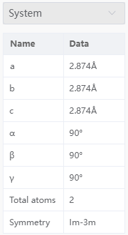
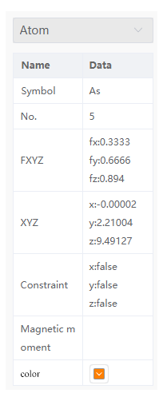

# Property bar

## Property System

- `a` `b` `c` `α` `β` `γ`：Displays the lattice constants of the current window structure. If there is no lattice, it is all none
- `Total atoms`: Displays the total number of atoms in the current window structure
- `Symmetry`: Displays the spatial group of the current window structure. If there is no lattice, it is none

## Atoms

- `Symbol`: Displays the element symbol of the selected atom; You can click to modify the element, from the `Modeling Menu` → `Modify Element`, or from the Quick Structure Tool modification
- `No.`: Displays the serial number of the selected atom in the current structure
- `FXYZ`: displays the fractional coordinates of the selected atoms, all empty if there is no lattice; You can click to modify the score coordinates
- `XYZ`: Displays the Cartesian coordinates of the selected atom; You can click to modify the Cartesian coordinates
- `Constraint`: Displays whether the selected atom is fixed or not; true is fixed, false is unfixed; You can click the setting or set it from [Limit atomic movement pop-up](/en/next/Q-Studio/界面及功能/菜单/qstudio_manual_settings_fixatom).
- `Magnetic moment`: Displays the magnetic moment of the selected atom; You can click to set the magnetic moment or from [Set magnetic moment pop-up](/en/next/Q-Studio/界面及功能/菜单/qstudio_manual_settings_magmom).
- `Color`: Displays the color of the selected atom; You can click to modify the color