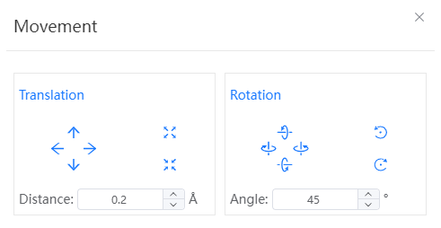
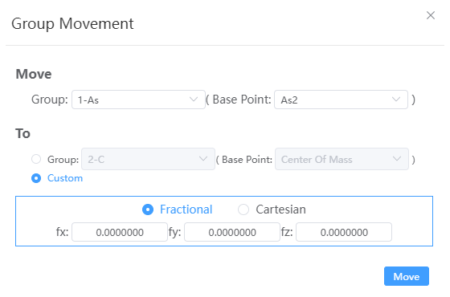
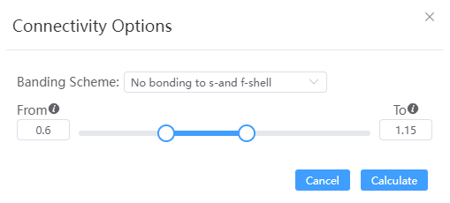

# Shortcut structure tools

- ：[New](./菜单/qstudio_manual_file.md)
- ：[Import From Local](./菜单/qstudio_manual_file.md)
- ：[Undo](./菜单/qstudio_manual_edit.md)
- ：[Redo](./菜单/qstudio_manual_edit.md)

---

- ：[Display style](./菜单/qstudio_manual_view_display.md)
- ：Selection Mode
- ：Rotation Mode
- ：Translation Mode
- ：Select residues only takes in the protein structure

---

- ：[Find Symmetry](./菜单/qstudio_manual_settings_symmtry_findsymmetry.md)
- ：[Lattice Parameters](./菜单/qstudio_manual_settings_latticeconstant.md)
- ：[Remove lattice](./菜单/qstudio_manual_settings_newlattice.md)
- ：[Build lattice](./菜单/qstudio_manual_settings_newlattice.md)

---

- ：[Add Atoms](./菜单/qstudio_manual_build_addatom.md)
- ：[Modify Element](./菜单/qstudio_manual_build.md)
- ：[Adjust Hydrogen](./菜单/qstudio_manual_build.md)

---

- ：Click to activate the Drag Atom Mode, and hold the left button on the atom to drag the atom to move
- ：Click to activate the Drag Molecule Mode, and hold down the left button on the molecule to drag the molecule to move
- ：Translation and rotation
  - Translation: Move the selected atom up, down, left, or right along the current viewing angle, based on the set distance
  - Rotation: Rotates the selected atom along or orthogonal to the current viewing angle, depending on the set angle, with the center of mass of the selected atom at the center of the selected atom

 
  

- ：Group Movement
  - Move：The group to be moved and the fiducial point to move, which can be the centroid of the selected group or an atom
  - To：The destination location to move to can be a group's centroid, best-fit line, best-fit plane, or custom fractional or Cartesian coordinates

  

- ：Moves the selected atoms up from the current viewing angle, based on the set distance
- ：Based on the set distance, moves the selected atoms down in the current viewing angle
- ：Moves the selected atoms to the left along the current viewing angle, based on the set distance
- ：Depending on the set distance, moves the selected atoms to the right along the current viewing angle

---

- ：calculate cheminal bonds
  
  

  - Calculate Bonds: The default option for the tool
  - Bond Option:
    - From：When the distance between atoms is less than the ideal bond length (according to the covalent radius) multiplied by the From coefficient, no chemical bond is formed
    - To：When the distance between atoms is greater than the ideal bond length (according to the covalent radius) multiplied by the To coefficient, no chemical bond is formed
  
    

  - Delete bonds: Deletes all chemical bonds between selected atoms; If no atom is selected, all chemical bonds in the structure are deleted
  - Monitor bonding: When checked, it will automatically monitor the formation of chemical bonds after any atomic operation

- ：Calculate hydrogen bonds
- ：Delete all bonds in the structure
- ：Modify the bonding type of the selected atom, which can be single, partial double, double, triple or aromatic

---

- ：Measure distance
- ：Measure angle
- ：Measure torsion
- ：Clear the measurements

:::tip NOTE：
Hover over the corresponding icon to display the corresponding function
:::
