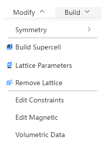

# Modify menu

<!--  -->
<!--  -->

- [Symmetry](/en/next/Q-Studio/界面及功能/菜单/qstudio_manual_settings_symmetry)

---

- Build Supercell: Supercell construction of structures with lattice according to periodic boundary conditions

- [Lattice Parameters](/en/next/Q-Studio/界面及功能/菜单/qstudio_manual_settings_latticeconstant)
- [Build or Remove Lattice](/en/next/Q-Studio/界面及功能/菜单/qstudio_manual_settings_newlattice)

---

- [Edit Constraints](/en/next/Q-Studio/界面及功能/菜单/qstudio_manual_settings_fixatom)
- [Edit Magnetic](/en/next/Q-Studio/界面及功能/菜单/qstudio_manual_settings_magmom)
- [Volumetric Data](/en/next/Q-Studio/界面及功能/菜单/qstudio_manual_settings_volumedata)