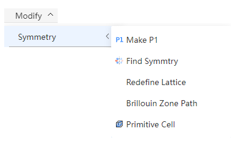

# Symmetry

For periodic structures, you can make it to P1, or try to find its symmetry, and generate the Brillouin zone path with high symmetry points according to its space group. Structures with specific space group can be transformed between primitive cell and conventional cell. You can also redefine the lattice of periodic structures.

- Make P1: sets the space group of the periodic structure to P1 (1)
- [Find Symmetry](/en/next/Q-Studio/界面及功能/菜单/qstudio_manual_settings_symmtry_findsymmetry)
- [Redefine Lattice](/en/next/Q-Studio/界面及功能/菜单/qstudio_manual_settings_symmtry_latticetransform)
- [Brillouin Zone Path](/en/next/Q-Studio/界面及功能/菜单/qstudio_manual_settings_symmtry_drawbrillouin)
- Primitive Cell and Conventional Cell: The structure of the first letter of the space group name is 'I', 'F', 'C', which can be converted between primitive cell and conventional cell, and if it is a rhombohedral (triangular) crystal system, it also needs to meet a=b>c

