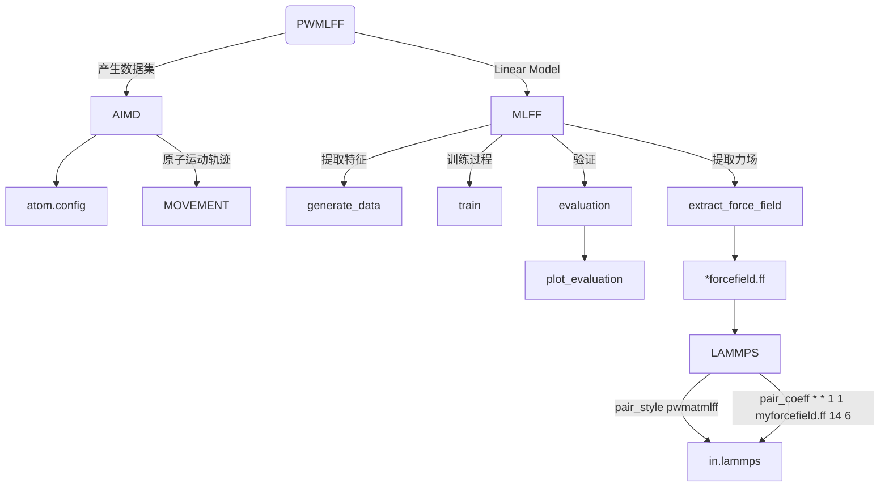

# Bulk SiC system

下文将以 Bulk SiC 系统为例，介绍如何使用 **PWMLFF Linear Model** 进行训练，以及如何使用训练好的模型进行预测。

整个程序运行逻辑大致分为：



## 1. 产生数据集

以 PWmat AIMD 模拟得到的 SiC 数据为例，数据文件为`MOVEMENT`，包含 100 个结构，每个结构包含 216 个原子。

**etot.input**输入文件示例：

```bash
4  1
JOB = MD
MD_DETAIL = 3 1000 1 300 1000
#MD_DETAIL = 3 1000 1 300 300
XCFUNCTIONAL = PBE
Ecut = 50
ECUT2 = 200
MP_N123 = 2 2 2 0 0 0 3
E_ERROR = 0
wg_error = 0
RHO_ERROR = 1E-4
ENERGY_DECOMP = T
OUT.STRESS = F
IN.ATOM = atom.config
IN.PSP1 = Si.SG15.PBE.UPF
IN.PSP2 = C.SG15.PBE.UPF
```

- 可选项`ENERGY_DECOMP`：是否将总 DFT 能量分解为属于每个原子的能量（原子能量）。结果输出在`MOVEMENT`文件中。如需使用或训练原子能量，需要将其设置为`T`。
- 可选项`OUT.STRESS`：是否输出应力信息，如需训练`Virial`，则需要将其设置为`T`。
- 其他参数含义参考[PWmat manual](http://www.pwmat.com/pwmat-resource/Manual.pdf)。

## 2. 训练过程

### 2.1 提取特征

新建目录，放置`MOVEMENT*`文件。或者`MOVEMENT*`文件也可以放置在其他目录下，只需要通过修改输入文件`*.json`中的`train_movement_path`路径进行训练。

### 2.2 训练输入文件

当前目录下，新建`*.json`文件(如`linear_sic.json`)，该文件包含一系列需要传入的参数。

**输入文件示例 ([输入文件其他参数说明](#5-输入文件其他参数说明))：**

```json
{   
    "train_movement_file":["./1_300_MOVEMENT", "./2_300_MOVEMENT"],
    "model_type": "Linear",
    "atom_type":[14, 6]
}
```

- `train_movement_file`: `MOVEMENT`文件存放名。可以设置同时多个文件。
- `model_type`：模型类型，现在训练所使用的模型。其他模型类型的训练及参数配置参考[参数细节](../../Parameter%20details)。
- `atom_type`：原子类型，14 和 6 分别为 Si 和 C 的原子序数

### 2.3 运行

以下 slurm 示例脚本适用于 Mcloud,提交任务时确保已经加载必要的环境和模块。如`conda activate PWMLFF`。

```bash
#!/bin/sh
#SBATCH --partition=3080ti
#SBATCH --job-name=mlff
#SBATCH --nodes=1
#SBATCH --ntasks-per-node=1
#SBATCH --gres=gpu:1
#SBATCH --gpus-per-task=1

PWMLFF train linear_sic.json > log
```

交互式运行：

```bash
$ srun -p 3080ti --gres=gpu:1 --pty /bin/bash
$ PWMLFF train linear_sic.json
```

---

程序运行后，会在程序执行目录下生成`forcefield`目录:

```
forcefield
├── forcefield.ff
├── fread_dfeat            
│   ├── energyL*           
│   ├── forceL*            
│   ├── linear*            
│   ├── weight_feat.*      
│   ├── energyL*           
│   ├── ...           
│   ├── feat*          
│   ├── weight_feat.*          
│   └── linear_fitB.ntype     
├── input          
│   └── *feature.in     
├── (output)                     
    └── grid*   # feature 1, 2时使用

```

## 3. 验证/测试

训练完成后，可以对模型进行验证/测试，以确定模型的拟合效果。

新建目录(如`MD`)，将另一个的`MOVEMENT`文件复制到该目录中。同时在`.json`文件中设置`test_movement_file`和`test_dir_name`参数。

```json
    "test_movement_file":["./MD/MOVEMENT"],
    "test_dir_name":"test_dir",
``````

**验证程序运行示例：**

将PWMLFF train linear_sic.json中的`train`修改为`test`：

```python
PWMLFF test linear_sic.json
```

程序运行完成后，验证结果保存在`test_dir_name`设置的`test_dir/`目录下


:::caution
`pre_fac_ei`不为0时，即进行atomic energy的训练时，如果用于验证的`MOVEMENT`中没有atomic energy，则`test`程序不会自动输出atomic-energy的验证图。
:::

## 4. Lammps 模拟

将训练完成后生成的`*.ff`力场文件用于 lammps 模拟。（需使用经过修改的[版本](https://github.com/LonxunQuantum/Lammps_for_PWMLFF)重新编译）

为了使用 PWMLFF 生成的力场文件，需要在 lammps 的输入文件中设置以下内容：

```bash
pair_style      pwmatmlff
pair_coeff      * * 1 1 forcefield.ff 14 6
```

其中`1`表示使用 Linear 模型产生的力场，`1`表示读取 1 个力场文件，`forcefield.ff`为 PWMLFF 生成的力场文件名称，`14` 和 `6` 分别为 Si 和 C 的原子序数

以下是lammps输入文件示例(nvt系综)：

```bash
units           metal
boundary        p p p
atom_style      atomic
processors      * * *
neighbor        2.0 bin
neigh_modify    every 10 delay 0 check no

read_data       POSCAR.lmp

pair_style      pwmatmlff
pair_coeff      * * 1 1 forcefield.ff 14 6
velocity        all create 300 206952 dist gaussian
timestep        0.001
fix             1 all nvt temp 300 300 0.1
thermo_style    custom step pe ke etotal temp vol press
thermo          1
dump            1 all custom 1 traj.xyz id type x y z  vx vy vz fx fy fz
run             1000 
```

## 5. 输入文件其他参数说明

```json
{
    "work_dir":"./work_dir",
    "reserve_work_dir": false,
    "train_movement_file":["MOVEMENT"],

    "forcefield_name": "forcefield.ff",
    "forcefield_dir": "forcefield",

    "test_movement_file":["./MD/MOVEMENT"],
    "test_dir_name":"test_dir",

    "model_type": "Linear",
    "atom_type":[14,6],
    "max_neigh_num":100, 

    "optimizer":{
        "pre_fac_force":0.5,
        "pre_fac_etot":0.5, 
        "pre_fac_ei":0.5        
    },
    
    "model":{
        "descriptor": {
            "Rmax":6.0, 
            "Rmin":0.5,
            
            "feature_type":[3,4],
            
            "1":{
                "numOf2bfeat": 24,
                "iflag_grid": 3,
                "fact_base": 0.2,
                "dR1": 0.5,
                "iflag_ftype": 3
            },
            "2":{
                "numOf3bfeat1" : 3,
                "numOf3bfeat2" : 3,
                "iflag_grid" : 3,
                "fact_base" : 0.2,
                "dR1" : 0.5,
                "dR2" : 0.5,
                "iflag_ftype" : 3
            },
            "3":{
                "n2b": 6,
                "w": [1.0, 1.5, 2.0]
            },
            "4":{
                "n3b": 20,
                "zeta": 2.0,
                "w": [0.5, 1.0, 1.5, 2.0, 2.5, 3.0, 3.5, 4.0, 4.5, 5.0]
            },
            "5":{
                "n_MTP_line":5
            },
            "6":{
                "J":3.0,
                "n_w_line":2,
                "w1":[0.9, 0.1, 0.8, 0.2, 0.7, 0.3, 0.6, 0.4],
                "w2":[0.1, 0.9, 0.2, 0.8, 0.3, 0.7, 0.3, 0.6]
            },
            "7":{
                "M":25,
                "M2":4,
                "weight_r":1.0
            },
            "8": {
                "M":8,
                "weight_r":1.0,
                "w":[1.0, 1.5, 2.0, 2.5]
            }
        }
    }
}

```

- `work_dir`: 训练过程中的中间文件保存目录。训练完成后自动删除。`reserve_work_dir`为`true`时，训练完成后不删除该目录。
- `train_movement_file`: `MOVEMENT`文件存放名。可以设置同时多个文件。
- `forcefield_name`: 生成的力场文件名称。可不设置。
- `forcefield_dir`: 生成的力场文件存放的目录。可不设置。
- `test_movement_file`: 用于训练完成后验证模型的`MOVEMENT`文件。([详情见验证测试部分](#3-验证测试))
- `test_dir_name`: 训练完成后验证模型的`MOVEMENT`文件的存放目录。
- `model_type`：模型类型，现在训练所使用的模型。其他模型类型的训练及参数配置参考[参数细节](../../Parameter%20details)。
- `atom_type`：原子类型，14 和 6 分别为 Si 和 C 的原子序数
- `max_neigh_num`：最大近邻原子数。
- `etot_weight`：训练时总能量的权重。
- `force_weight`：训练时原子力的权重。
- `ei_weight`：训练时原子能量的权重，设置为 0 时表示不训练原子能量。
- `model`: 模型参数，具体参数配置参考[参数细节](../../Parameter%20details)。
- `feature_type`：特征类型，3,4 对应 2-body and 3-body Gaussian feature，详见[特征类型](../../Appendix-1)