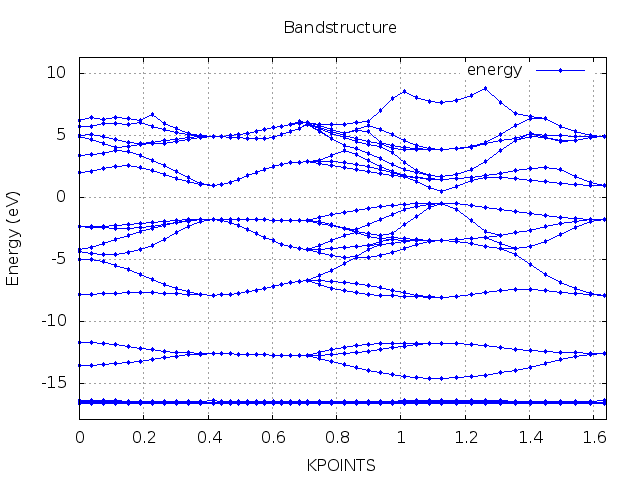

# HSE bandsctructure calculation

HSE bandstructure calculation for AsGa

## Input files

atom.config

```dotnetcli
        2
 LATTICE
      0.00000000     2.71535000     2.71535000
      2.71535000     0.00000000     2.71535000
      2.71535000     2.71535000     0.00000000
 POSITION
  14     0.00000000     0.00000000     0.00000000 0 0 0
  14     0.25000000     0.25000000     0.25000000 0 0 0
```

etot.input

```dotnetcli
   4 1
   JOB = NONSCF
   IN.PSP1 = Ga.SG15.PBE.UPF
   IN.PSP2 = As.SG15.PBE.UPF
   IN.ATOM = atom.config
   XCFUNCTIONAL = HSE
   IN.VR = T
   IN.KPT = T
```

:::tip Note
   1. Read IN.VR from previous SCF calculation. To copy OUT.VR, OUT.FERMI and OUT.HSEWR* from the HSE SCF calculation of example [GaAs HSE SCF calculation](HSEscf.md) to your current working drectory and rename IN.VR.
   2. IN.KPT is the k-points file which PWmat will use for band structure calculation, one can use "split_kp.x" utility to get it. You should prepare an input file for "split_kp.x", which can be named "gen.kpt":

    ```dotnetcli
          BAND                    # COMMENT line
      10                      # number of k-points between X and R
      0.500  0.000  0.000  X  # reciprocal coordinates; label 'X' for X point
      0.500  0.500  0.500  R
      10
      0.500  0.500  0.500  R
      0.500  0.500  0.000  M
      10
      0.500  0.500  0.000  M
      0.000  0.000  0.000  G
      10
      0.000  0.000  0.000  G
      0.500  0.500  0.500  R
    ```

    ```dotnetcli
          split_kp.x gen.kpt
    ```
    After running "`split_kp.x gen.kpt`", it will generate "`IN.KPT`" and "`HIGH_SYMMETRY_POINT`" (high-symmetry points information) files.  
:::

As.SG15.PBE.UPF, Ga.SG15.PBE.UPF

:::tip Note
   As.SG15.PEB.UPF and Ga.SG15.PBE.UPF are the pseudopotential files.
:::

## Calculations
1. You can submit PWmat tasks in different ways:

```dotnetcli
   mpirun -np 4 PWmat | tee output
```

:::tip Note
Run the command directly
:::

```dotnetcli
   #!/bin/bash
   #PBS -N SCF
   #PBS -l nodes=1:ppn=4
   #PBS -q batch
   #PBS -l walltime=100:00:00

   ulimit -s unlimited
   cd $PBS_O_WORKDIR

   mpirun -np 4 PWmat | tee output
```

:::tip Note
Submit the task with a pbs script
::: 

2. After NONSCF calculation, you can run "`plot_band_structure.x`" to obtain band structure in your current working directory. Then it will generate the following files: bandstructure.eps, bandstructure.png, bandstructure.pdf and bandstructure_1.txt (the data
file of band structure), which can be used to plot band by  *origin* or *gnuplot*. Note, for "spin=2", another data file bandstructure_2.txt will be generated.

```dotnetcli
   plot_band_structure.x
```


