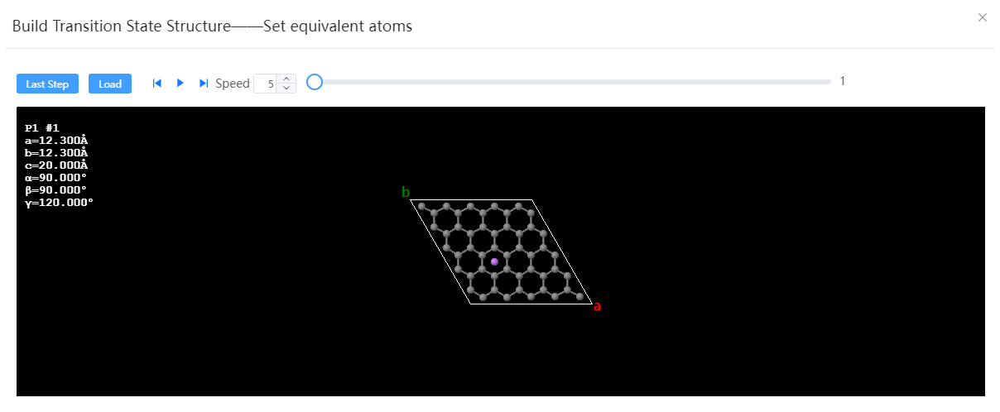
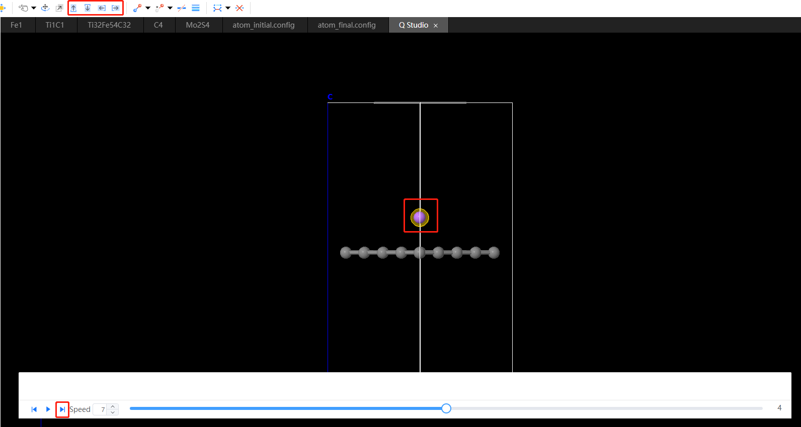

# Transition state structure

Take the transition of lithium atoms at the hollow position on graphene as an example:

1. The initial and final structure of the completed structure optimization will be imported.
   
<table><tr>
    <td> 
        

            
        

    </td>
        <td> 
        

            
        

        </td>
</tr></table>

2. Click `Build` → `Build Transition State Structure`, select the initial and final state structure in the pop-up window, click `Auto Find`, set the `Images` to 5, and click `preview`.
   

3. Play the path to observe, confirm that it is correct, and then click `Load`.

4. Fine-tune the position of lithium atoms frame by frame within the new window
   

