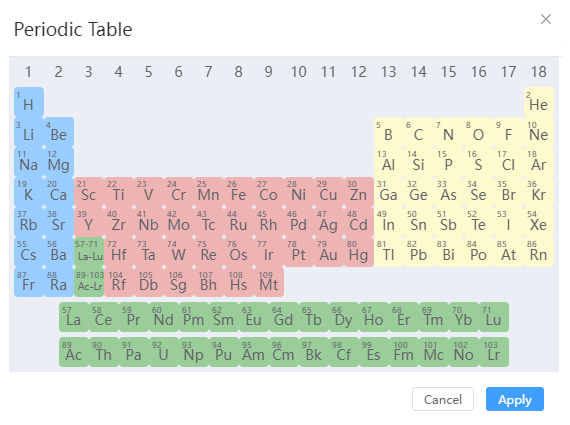

# Build menu
<!--  -->

- [Build Crystal](./qstudio_manual_build_crystal)
- [Sketch Molecule](./qstudio_manual_build_molecule)
- [Build Nanotube](./qstudio_manual_build_nanotube)
- [Build Nanocluster](./qstudio_manual_build_nanocluster)
- [Build Amorphous](./qstudio_manual_build_packmol)
- [Build Heterostructure](./qstudio_manual_build_hetero)
- [Build Transport Device](./qstudio_manual_build_transport)
- [Build Transition State Structure](./qstudio_manual_build_neb)
  
:::tip NOTE：
For specific modeling operations, see [Modeling Examples](../../建模示例/qstudio_example_2d) section
:::

---

- [Add Atoms](./qstudio_manual_build_addatom)
- Modify Element: Modify the elements of the selected atom, and support the selection of elements from the periodic table

- Adjust Hydrogen: Automatically adds hydrogen atoms to the selected atom based on elemental and geometric position information

---

- [Cleave surface](./qstudio_manual_build_cleavesurface)

